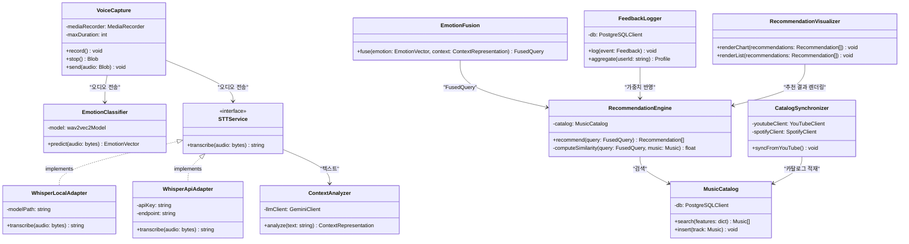
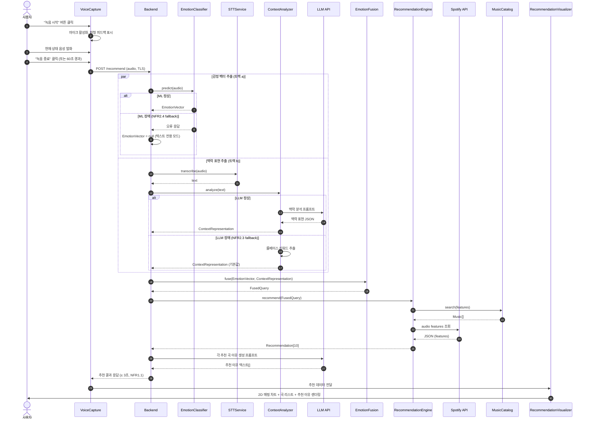
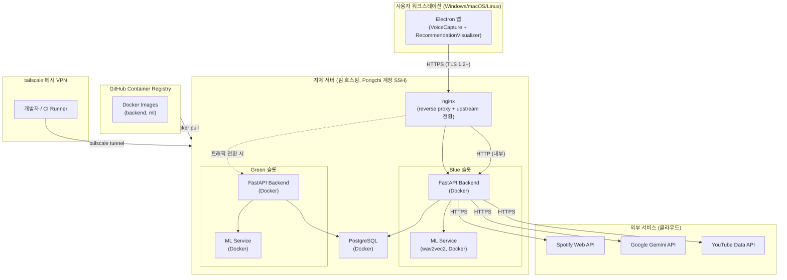

# Architecture Overview — AI 기반 감정 분석 음악 추천 시스템

> 본 문서는 4+1 아키텍처 뷰 모델 (Kruchten) 에 따라 SE-final-project 의 시스템 아키텍처를 5개 뷰로 정리한다. 결정의 *사유* 는 `docs/회의록/decisions/` 의 ADR 시리즈가 SSOT 이며, 본 문서는 살아있는 개요(living overview) 다.

- 작성일: 2026-05-14
- 작성자: CWNU CE 박우현, 신성민, 정원준
- 버전: v1.0
- 참조: SRS v1 (`docs/회의록/design/srs-v1.md`), ADR-0001, ADR-0002

---

## 1. Logical View — 컴포넌트 구조

> 시스템을 구성하는 *기능적 책임 단위* 의 정적 구조. SRS §7 컴포넌트 사전을 기준으로 10개 컴포넌트를 4개 영역으로 분류한다.

### 컴포넌트 일람

| 영역 | 컴포넌트 | 책임 |
|---|---|---|
| Client | `VoiceCapture` | Electron MediaRecorder로 마이크 음성을 녹음하고 TLS를 통해 백엔드로 전송. 최대 60초 제한, 녹음 중 파형 시각 피드백 제공 (FR2.1~FR2.4) |
| Client | `RecommendationVisualizer` | 추천 결과를 valence × energy 2D 매핑 차트로 렌더링하고 각 곡의 LLM 추천 이유 텍스트를 카드 UI로 표시 (FR5.1~FR5.3) |
| Backend | `STTService` (어댑터) | 음성 바이트를 텍스트로 변환하는 추상 인터페이스. `WhisperLocalAdapter`(로컬 Whisper Small)와 `WhisperApiAdapter`(Whisper API) 두 구현체를 환경변수로 교체 가능 (ADR-0002) |
| Backend | `ContextAnalyzer` (LLM) | STT 텍스트를 입력받아 Gemini LLM에 맥락 분석 프롬프트를 호출하고 `ContextRepresentation`(키워드, 무드, 상황)을 생성 (FR3.3) |
| Backend | `EmotionFusion` | ML 트랙에서 온 `EmotionVector`(valence, arousal, dominance)와 LLM 트랙에서 온 `ContextRepresentation`을 결합해 단일 `FusedQuery`를 생성. 두 트랙이 비대칭적으로 도착해도 처리 가능하도록 설계 (FR3.4) |
| Backend | `RecommendationEngine` | `FusedQuery`를 기준으로 `MusicCatalog`에서 Spotify audio features 코사인 유사도 매칭을 수행하고 상위 K=10 곡을 선정 (FR4.1~FR4.2) |
| Backend | `FeedbackLogger` | 좋아요/싫어요/재생시작/완료 이벤트를 PostgreSQL에 기록하고 사용자 프로필을 집계해 다음 추천 가중치로 반영 (FR6.1~FR6.4) |
| Backend | `CatalogSynchronizer` | 스케줄러 기반으로 YouTube 감성 플레이리스트에서 시드 트랙을 추출하고 Spotify API로 매칭해 `MusicCatalog`에 적재 (FR7.1~FR7.3) |
| ML | `EmotionClassifier` | 캐글 감정 음성 데이터셋으로 fine-tuning된 wav2vec2 모델. 오디오 바이트를 받아 valence·arousal·dominance 기반 `EmotionVector`를 반환. 목표 정확도 ≥ 70% (NFR4.3) |
| DB | `MusicCatalog` | PostgreSQL + JSONB 스키마로 Spotify 트랙 메타와 audio features를 저장하는 곡 풀. `RecommendationEngine`의 검색 대상이며 `CatalogSynchronizer`가 주기적으로 갱신 |

### 핵심 관계 (mermaid classDiagram)

<!-- 출처: docs/02-design-document.html §4 클래스 다이어그램 발췌 후 4+1 Logical View 설명용으로 재구성 -->



### 책임 분리 원칙 (SRP) 검증

**어댑터 패턴 도입 사유 (`STTService`)**

`STTService`는 추상 인터페이스로 설계되어 `WhisperLocalAdapter`와 `WhisperApiAdapter` 두 구현체를 환경변수 `STT_PROVIDER` 하나만으로 교체할 수 있다 (ADR-0002). 이 결정의 핵심 근거는 운영 중 비용·지연 trade-off 대응과 NFR2.3(LLM 장애 시 fallback) 확장 가능성이다. 단일 Whisper 백엔드만 사용할 경우 장애 시 추천 파이프라인 전체가 중단될 위험이 있으나, 어댑터 패턴을 통해 백엔드 교체 없이 구현체만 교체할 수 있다. Clova(Naver STT)는 벤더 종속과 가격 정책 변동 리스크로 탈락했다.

**`EmotionFusion` 분리 사유**

감정 벡터(ML 트랙)와 맥락 표현(LLM 트랙)을 융합하는 로직을 별도 컴포넌트로 분리한 이유는 두 가지다. 첫째, **테스트 가능성**: ML 또는 LLM 어느 한쪽만 mock 처리하고 융합 로직만 단위 테스트할 수 있다. 둘째, **비대칭 처리**: UC-03 병렬 처리에서 ML 트랙(≤ 1.5초)과 LLM 트랙(최대 1.5초)은 독립적으로 완료 시점이 다를 수 있다. `EmotionFusion`은 두 결과를 기다렸다가 `FusedQuery`를 생성하는 동기화 지점(rendezvous)을 담당한다. ML 장애 시(NFR2.4) `EmotionVector = null` 상태를 받아들이고 텍스트 기반 추천만으로 응답하는 분기도 이 컴포넌트에서 처리한다.

**`FeedbackLogger` 독립 분리**

피드백 수집을 `RecommendationEngine`에 합치지 않고 별도 컴포넌트로 분리함으로써 추천 알고리즘 변경이 피드백 수집 로직에 영향을 주지 않도록 했다. 또한 재생률·좋아요 집계는 비동기 배치로도 처리 가능해 NFR1.1(P95 ≤ 3초) 응답 시간 예산에 영향을 주지 않는다.

---

## 2. Process View — 런타임 흐름

> 런타임에 컴포넌트들이 *어떻게 협력* 하는가. UC-03 핵심 흐름의 **듀얼 트랙 병렬 처리**에 초점을 맞춘다.

### UC-03 듀얼 트랙 시퀀스

아래 시퀀스 다이어그램은 SRS §6.2 UC-03의 주 시나리오 11단계를 표현한다. 6단계의 병렬 처리는 `par` 프레임, LLM·ML 장애 대체는 `alt` 프레임으로 나타낸다.

<!-- 출처: docs/02-design-document.html §5 시퀀스 다이어그램 발췌 -->



### 응답 시간 예산 (NFR1.1 P95 ≤ 3초)

백엔드가 요청을 수신한 시점부터 클라이언트가 결과를 렌더링하기까지의 예산을 아래와 같이 배분한다. 트랙 a(ML)와 트랙 b(STT+LLM)는 FastAPI `asyncio.gather()`로 병렬 실행되므로 두 경로 중 긴 쪽만 예산에 산입된다.

| 단계 | 예산 |
|---|---|
| 음성 전송 (TLS, VC → BE) | ≤ 200 ms |
| ML 추론 `EmotionClassifier` (NFR1.3) | ≤ 1,500 ms |
| STT 변환 `STTService` | ≤ 800 ms |
| LLM 맥락 분석 `ContextAnalyzer` | ≤ 700 ms |
| **트랙 b 합계 (STT + LLM, 직렬)** | **≤ 1,500 ms** |
| 병렬 max (트랙 a vs 트랙 b) | ≤ 1,500 ms |
| 융합 `EmotionFusion` + 추천 매칭 `RecommendationEngine` | ≤ 300 ms |
| LLM 추천 이유 생성 (병렬 가능 시 흡수) | ≤ 800 ms |
| 응답 전송 + 클라이언트 렌더링 | ≤ 100 ms |
| **총합 (P95 목표)** | **≤ 3,000 ms** |

> **설계 여유**: 추천 이유 생성은 추천 결과 반환과 동시에 스트리밍 방식으로 클라이언트에 전송하거나, 추천 매칭과 병렬로 시작하는 방식을 Sprint #3에서 검토한다. 이 경우 총합에서 추천 이유 생성 시간을 제외할 수 있어 목표 달성 마진이 늘어난다.

### Fallback 경로

NFR2.3과 NFR2.4가 요구하는 장애 대응 시나리오는 위 시퀀스 다이어그램의 `alt` 프레임에 반영되어 있다.

**LLM 장애 (NFR2.3) — A1 대체 시나리오**

`ContextAnalyzer`가 Gemini API 호출 실패를 감지하면 룰베이스 키워드 추출기로 fallback한다. 입력 텍스트에서 불용어를 제거하고 감정 관련 형용사/동사를 추출해 기본 `ContextRepresentation`을 생성한다. 추천 이유 텍스트는 "유사 감성 곡"과 같은 정형 템플릿으로 대체된다. 사용자는 추천 품질이 다소 저하될 수 있으나 서비스가 중단되지는 않는다.

**ML 장애 (NFR2.4) — A2 대체 시나리오**

`EmotionClassifier` 호출 실패 시 `EmotionVector = null` 상태로 `EmotionFusion`에 전달된다. `EmotionFusion`은 `ContextRepresentation`만으로 `FusedQuery`를 생성하고 `RecommendationEngine`은 텍스트 기반 유사도 매칭만으로 상위 K곡을 선정한다. 2D 매핑 차트에서는 ML 감정 좌표 대신 LLM이 추론한 valence/energy 추정값이 표시된다.

**STT 어댑터 교체**

STT 백엔드 장애 시에는 환경변수 `STT_PROVIDER` 값을 변경하고 서비스를 재시작하거나, 추후 런타임 교체 API를 추가함으로써 대응한다. 어댑터 패턴(ADR-0002)이 이 교체 비용을 최소화한다.

---

## 3. Development View — 모듈/패키지 구조

> 개발자 관점의 *소스 코드 조직*. 현재(Sprint #0 완료, Sprint #1 진입 시점)의 실제 디렉터리 상태와 향후 스프린트별 확장 계획을 함께 기술한다.

### 디렉터리 구조

```
SE-final-project/
├── client/                    # Electron + Next.js (TypeScript)
│   ├── electron/
│   │   └── main.ts            # Electron 메인 프로세스
│   ├── pages/                 # Next.js 페이지 라우터
│   │   └── index.tsx          # 메인 화면 (음성 입력 + 추천 결과)
│   ├── components/            # ⏳ Sprint #1 (US-3, US-5)
│   │   ├── VoiceCapture/      # 녹음 UI + 파형 표시
│   │   └── RecommendationVisualizer/  # 2D 차트 + 곡 리스트
│   └── lib/
│       └── api.ts             # Backend API 클라이언트 (HTTP)
├── backend/                   # FastAPI (Python)
│   ├── app/
│   │   ├── main.py            # FastAPI 진입점, 라우터 등록
│   │   ├── auth/              # ⏳ Sprint #1 (US-1, US-2)
│   │   │   ├── router.py      # POST /auth/register, /auth/login
│   │   │   └── service.py     # bcrypt 해싱, JWT 발급
│   │   ├── recommend/         # ⏳ Sprint #2–3 (US-4 → US-13)
│   │   │   ├── router.py      # POST /recommend
│   │   │   ├── emotion_fusion.py   # EmotionFusion
│   │   │   └── engine.py      # RecommendationEngine
│   │   ├── feedback/          # ⏳ Sprint #4 (US-17, US-18)
│   │   │   └── router.py      # POST /feedback
│   │   └── stt/               # ⏳ Sprint #3 (US-10)
│   │       ├── interface.py   # STTService 추상 인터페이스
│   │       ├── whisper_local.py    # WhisperLocalAdapter
│   │       └── whisper_api.py     # WhisperApiAdapter
│   ├── tests/                 # Pytest 단위·통합 테스트
│   └── prompts/               # LLM 프롬프트 템플릿 (버전 관리)
│       ├── context_analyze.txt
│       └── recommendation_reason.txt
├── ml/                        # wav2vec2 학습/서빙 (Python)
│   ├── train/                 # ⏳ Sprint #2 (US-6)
│   │   ├── dataset.py         # 캐글 emotion dataset 로더
│   │   └── finetune.py        # wav2vec2 fine-tuning 스크립트
│   └── serve/                 # ⏳ Sprint #2 (US-6)
│       └── emotion_classifier.py  # EmotionClassifier HTTP 서비스
├── infra/                     # Docker + tailscale + Blue-Green
│   ├── docker-compose.yml     # backend + ml + postgres 컨테이너
│   ├── docker-compose.blue.yml
│   ├── docker-compose.green.yml
│   └── nginx/
│       └── nginx.conf         # upstream 전환 설정
└── docs/
    ├── architecture-overview.md    # 본 문서
    ├── PROJECT_PLAN.md
    └── 회의록/
        ├── design/
        │   └── srs-v1.md
        └── decisions/
            ├── 0001-electron-as-client-platform.md
            └── 0002-tech-stack.md
```

### 의존성 흐름

컴포넌트 간 의존성은 **단방향 계층**으로 유지한다.

```
client/  →  backend/  →  ml/serve/
                   ↘
              외부 API (Spotify, Gemini, YouTube)
```

- `client/` → `backend/`: HTTP REST (TLS). `lib/api.ts`가 엔드포인트를 추상화.
- `backend/` → `ml/serve/`: HTTP 또는 동일 Python 런타임 직접 임포트. 모듈 임포트를 우선하고 성능 요구 시 별도 ML 서버로 분리 가능 (ADR-0002, 개발 동질성).
- `backend/` → Spotify Web API: `RecommendationEngine` 내부에서 `SpotifyClient` 호출.
- `backend/` → Gemini LLM API: `ContextAnalyzer` 내부에서 `GeminiClient` 호출. 모델 ID는 환경변수 `LLM_PROVIDER` 로 분리.
- `backend/` → YouTube Data API: `CatalogSynchronizer` 스케줄러 호출.

모든 API 키와 비밀정보는 환경변수로 관리하며 클라이언트에 절대 노출하지 않는다 (NFR3.5).

### 빌드/배포 흐름

```
개발자 Push → GitHub Actions (CI)
  ├── client: ESLint + Vitest
  ├── backend: Ruff lint + Pytest
  └── ml: Pytest (모델 추론 smoke test)
              ↓ (main 브랜치 병합 시)
          Docker Build → GHCR (GitHub Container Registry)
              ↓
          자체 서버: docker compose pull → Blue-Green 슬롯 교체
```

현재 GitHub Actions CI는 이슈 #4에서 구성 예정이다. 배포 자동화(GHCR → SCP+SSH)는 Sprint #5(US-21)에서 Blue-Green 무중단 배포로 완성된다. Jenkins 기반 파이프라인 강화는 이슈 #31에서 검토 중이다.

### 패키지 관리 및 코드 스타일

| 영역 | 도구 | 설정 파일 |
|---|---|---|
| Client (TypeScript) | npm + ESLint + Prettier | `client/package.json` |
| Backend (Python) | pip + Ruff | `backend/pyproject.toml` |
| ML (Python) | pip + Ruff | `ml/pyproject.toml` |
| 커밋 컨벤션 | Conventional Commits | — |
| 브랜치 전략 | GitHub Flow (`feature/US-<n>-<desc>`) | `docs/PROJECT_PLAN.md §8` |

---

## 4. Deployment View — 물리/운영 토폴로지

> 컴포넌트가 *어떤 머신* 에 어떻게 배치되는가. 현재 확정된 1-서버 구성과 향후 Blue-Green 확장 계획을 함께 서술한다.

### 토폴로지 다이어그램

<!-- 출처: docs/02-design-document.html §1 아키텍처 다이어그램을 Deployment View 관점으로 재편집 -->



### 노드 일람

| 노드 | 위치 | 실행 컴포넌트 | 비고 |
|---|---|---|---|
| 사용자 워크스테이션 | 사용자 PC | Electron 앱 (VoiceCapture, RecommendationVisualizer) | Windows 10+ / macOS 12+ / Ubuntu 22+ (NFR6.1) |
| 자체 서버 (Blue 슬롯) | 팀 호스팅 서버 | FastAPI Backend, ML Service (wav2vec2) | 현재 활성 슬롯 |
| 자체 서버 (Green 슬롯) | 동일 서버 내 컨테이너 | FastAPI Backend, ML Service | Blue-Green 전환 대기 슬롯 |
| 자체 서버 (공용) | 동일 서버 | PostgreSQL, nginx | 두 슬롯 공유 |
| GHCR | GitHub 인프라 | Docker 이미지 레지스트리 | CI가 빌드 후 푸시 |
| Spotify Web API | 클라우드 (Spotify) | audio features, 트랙 메타 제공 | 추천당 1–10회 호출 |
| Google Gemini API | 클라우드 (Google) | 맥락 분석, 추천 이유 생성 | `gemini-3.1-flash-lite-preview`, 모델 ID는 env 분리 |
| YouTube Data API | 클라우드 (Google) | 감성 플리 트랙 메타 | 카탈로그 동기화 시 호출 |

### 네트워크 구성

| 구간 | 프로토콜 | 비고 |
|---|---|---|
| 사용자 ↔ Backend | HTTPS (TLS 1.2+) | NFR3.1 준수; nginx가 TLS 종료 |
| Backend ↔ ML Service | HTTP (컨테이너 내부 네트워크) | 동일 서버 내 Docker 네트워크 |
| Backend ↔ External APIs | HTTPS | API 키 환경변수 관리 (NFR3.5) |
| 개발자/CI ↔ 자체 서버 | tailscale 메시 VPN | ADR-0002; Public IP·SSH 포트 노출 없음 |
| CI (GitHub Actions) ↔ GHCR | HTTPS | 이미지 빌드 및 레지스트리 푸시 |

### Blue-Green 배포 흐름

무중단 배포(NFR2.2)는 동일 서버 내 컨테이너 이중화로 구현한다. nginx의 upstream 설정을 변경해 트래픽을 Blue ↔ Green 슬롯 간 전환하며, 전환 소요 시간은 1초 이내를 목표로 한다.

1. CI가 새 Docker 이미지를 GHCR에 푸시.
2. 자체 서버에서 비활성 슬롯(예: Green)의 컨테이너를 새 이미지로 교체 후 헬스체크 통과 대기.
3. nginx `upstream` 설정을 Green으로 재로드 (`nginx -s reload`, 다운타임 0).
4. 구 슬롯(Blue)은 롤백을 위해 일정 시간 유지 후 종료.

현재 기본 구성은 `docker-compose.yml` 단일 파일로 운영하며, Jenkins 기반 자동화는 이슈 #31에서 본격 구현 예정이다.

### 보안 고려사항

- 음성 원본 데이터는 분석 완료 즉시 폐기하며 감정 벡터만 저장 (NFR3.2).
- STT 텍스트는 사용자 동의 시에만 로깅 (NFR3.3).
- 비밀번호는 bcrypt(cost ≥ 12) 해싱 (NFR3.4).
- tailscale 장애에 대비해 비상용 SSH 키 1개를 별도 보존 (ADR-0002 리스크 완화).
- 단일 서버 단일 장애점(SPOF)은 Blue-Green 컨테이너 이중화로 완화하며, 향후 2대 물리 분리를 검토 (ADR-0002 부정적 결과).

---

## 5. Use Case View — 사용 시나리오

> 위 4개 뷰가 *왜* 그렇게 설계됐는지를 사용자 시나리오로 정당화한다. 아키텍처 결정의 기능적 근거를 제공하는 뷰다.

### 유스케이스 목록

SRS §6.1에 정의된 8개 유스케이스 중 아키텍처 설계에 가장 큰 영향을 준 케이스를 중심으로 서술한다.

| ID | 이름 | Primary Actor | 아키텍처 영향 |
|---|---|---|---|
| UC-01 | 회원가입 | 사용자 | `auth/` 모듈, bcrypt, JWT |
| UC-02 | 로그인 / 로그아웃 | 사용자 | `auth/` 모듈, JWT 갱신 |
| **UC-03** | **음성으로 음악 추천 받기** ⭐ | 사용자 | 듀얼 트랙 아키텍처 전체, NFR1.1 응답 예산 |
| UC-04 | 추천 곡 재생 | 사용자 | `RecommendationVisualizer`, YouTube embed |
| UC-05 | 피드백 남기기 | 사용자 | `FeedbackLogger`, 개인화 가중치 |
| UC-06 | 추천 이력 조회 | 사용자 | `FeedbackLogger` 집계 API |
| UC-07 | 프로필 수정 | 사용자 | `Profile` 엔티티, `auth/` 확장 |
| UC-08 | 음악 카탈로그 새로고침 | 관리자 | `CatalogSynchronizer` 스케줄러 |

유스케이스 다이어그램 전체: `docs/회의록/design/diagrams/usecase.svg`

### 핵심 시나리오 — UC-03 상세 (SRS §6.2 발췌)

**주 시나리오 (Main Flow) 11단계:**

1. 사용자가 "녹음 시작"을 누른다.
2. 시스템이 마이크를 활성화하고 시각적 피드백(파형)을 표시한다.
3. 사용자가 자신의 상태를 말한다.
4. 사용자가 "녹음 종료"를 누르거나 60초가 경과한다.
5. 시스템이 음성을 백엔드로 전송한다 (TLS).
6. 백엔드는 **병렬로** (a) `EmotionClassifier`로 감정 벡터 추출, (b) `STTService` → `ContextAnalyzer`(LLM)로 맥락 표현 추출을 수행한다.
7. `EmotionFusion`이 (a)와 (b)를 융합한다.
8. `RecommendationEngine`이 융합 결과로 카탈로그에서 유사도 매칭하여 상위 10곡을 선정한다.
9. LLM이 각 추천 곡에 대한 짧은 추천 이유를 생성한다.
10. 시스템이 추천 결과를 클라이언트로 응답한다 (≤ 3초, NFR1.1).
11. 클라이언트가 2D 감정-음악 매핑 차트와 곡 리스트, 추천 이유를 렌더링한다.

**대체 시나리오:**

- **A1 (LLM API 장애):** 6(b)에서 LLM 응답 실패 → 룰베이스 키워드 추출로 fallback (NFR2.3). 추천 이유는 정형 템플릿 텍스트로 대체. → `ContextAnalyzer` 내부 fallback 분기, 어댑터 패턴과 동일 구조로 확장 가능.
- **A2 (ML 모델 장애):** 6(a)에서 `EmotionClassifier` 실패 → `EmotionVector = null`으로 맥락 표현만으로 추천 진행 (NFR2.4). → `EmotionFusion` 분리 설계의 직접적 정당화.
- **A3 (Spotify API 호출 실패):** 캐시된 카탈로그에서만 매칭. 캐시도 비어있으면 오류 메시지 표시. → `MusicCatalog` 로컬 캐시 중요성.

**예외 시나리오:**

- **E1 (마이크 권한 거부):** 1단계에서 권한 거부 → 권한 안내 다이얼로그 표시, 유스케이스 종료. → `VoiceCapture`가 권한 상태를 먼저 확인.
- **E2 (음성이 너무 짧음, < 2초):** 5단계에서 검증 실패 → "조금 더 길게 말씀해 주세요" 안내, 1단계로 복귀. → Backend 입력 유효성 검증.
- **E3 (네트워크 단절):** 5단계에서 전송 실패 → 재시도 옵션 제공. → `VoiceCapture`의 오류 처리.

### 페르소나-시나리오 매핑

| 페르소나 | 직업 / 연령 | 핵심 시나리오 | 연관 NFR |
|---|---|---|---|
| 김지원 | IT 개발자, 27세 | "야근 후 퇴근길 — 음성 한 마디로 분위기 곡 추천" | NFR1.1 (빠른 응답), NFR5.1 (≤ 3 클릭) |
| 박서준 | 음악 전공, 22세 | "감성 2D 차트로 내 현재 감정 위치를 시각적으로 탐색" | NFR5.1 (직관적 UI), FR5.1 (2D 차트) |
| 이수민 | 큐레이터, 34세 | "YouTube 플리 → Spotify 매칭 자동화 + 무중단 서비스" | NFR2.2 (Blue-Green), FR7.1~7.3 |

페르소나 상세 및 AI 인터뷰 로그: `docs/ai-interviews/` (이슈 #6, #7에서 작성 예정).

### UC-03가 아키텍처에 미친 영향 요약

UC-03의 **6단계 병렬 처리** 요구가 FastAPI 선택(asyncio 기반 병렬 IO, ADR-0002)을 직접 결정했다. Express는 Python ML과 IPC 비용이 추가로 발생하고, Flask는 비동기 성능이 부족해 탈락했다. **응답 시간 ≤ 3초(NFR1.1)** 제약은 응답 시간 예산 표(Process View §2)로 구체화되어 각 컴포넌트의 구현 목표치를 제시한다. **Fallback 요구(NFR2.3, NFR2.4)** 는 `EmotionFusion` 분리와 `STTService` 어댑터 패턴의 핵심 정당화 근거다.

---

## 참조

- SRS v1: `docs/회의록/design/srs-v1.md`
- ADR-0001 (Electron 채택): `docs/회의록/decisions/0001-electron-as-client-platform.md`
- ADR-0002 (기술 스택): `docs/회의록/decisions/0002-tech-stack.md`
- 02-design-document.html (통합 설계 문서): `docs/02-design-document.html`
- PROJECT_PLAN.md: `docs/PROJECT_PLAN.md`
- 유스케이스 다이어그램: `docs/회의록/design/diagrams/usecase.svg`
- 시스템 컨텍스트 다이어그램: `docs/회의록/design/diagrams/system-context.svg`

---

## 변경 이력

| 버전 | 일자 | 변경 사항 |
|---|---|---|
| v1.0 | 2026-05-14 | 초안 작성 (Sprint #1 W11 진입 시점) — 5개 뷰 + mermaid 다이어그램 4개 + 응답 시간 예산 표 포함 |
