# AI 기반 감정 분석 음악 추천 시스템 — 최종 보고서

**CWNU 컴퓨터공학과 3학년 1학기 소프트웨어 공학 기말 프로젝트**

| 항목 | 내용 |
|---|---|
| 팀원 | 정원준, 신성민, 박우현 |
| 제출일 | 2026-06-18 |
| 저장소 | https://github.com/woohyun212/SE-final-project |

---

## 1. 프로젝트 개요

사용자의 **음성 한 마디**를 입력받아 현재 감정 상태를 분석하고, 그 감정에 어울리는 음악을 추천하는 데스크탑 애플리케이션이다.

### 핵심 아이디어 — 듀얼 트랙 분석

```
                 ┌─ ML 트랙:   음성 → 감정 벡터 (wav2vec2)
   🎤 음성 입력 ─┤                                    ↘
                 └─ LLM 트랙:  STT → 맥락 (Gemini)    EmotionFusion → 🎵 추천
```

음성 신호에서 wav2vec2 모델로 비언어적 감정(valence, arousal, dominance)을 추출하는 동시에, Whisper STT로 발화 내용을 텍스트로 변환해 Gemini LLM으로 맥락을 분석한다. 두 트랙의 결과를 **EmotionFusion** 컴포넌트에서 결합해 최종 추천에 활용한다.

---

## 2. 기술 스택

| 영역 | 기술 | 선택 근거 |
|---|---|---|
| 클라이언트 | Electron + Next.js (TypeScript) | 크로스플랫폼 데스크탑, React 생산성 |
| 백엔드 | FastAPI (Python 3.12) | asyncio 기반 병렬 IO, ML과 동일 언어 |
| ML | wav2vec2 (fine-tuning) | 비언어 감정 특징 추출 최적화 |
| LLM | Google Gemini (flash-lite-preview) | 맥락 분석, 추천 이유 생성 |
| STT | Whisper Small (로컬) | 어댑터 패턴 — API 교체 가능 |
| DB | PostgreSQL 16 | 추천 이력, 피드백, 음악 카탈로그 |
| 배포 | 자체 서버 + Blue-Green + HTTPS | 무중단 배포, Let's Encrypt |
| CI/CD | GitHub Actions + GHCR | 자동 빌드·테스트·배포 |

---

## 3. 시스템 아키텍처

### 3.1 전체 구성도

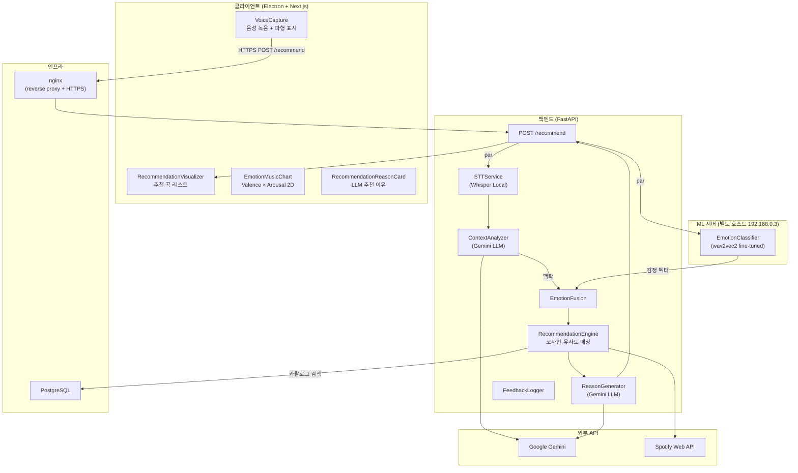

### 3.2 배포 토폴로지

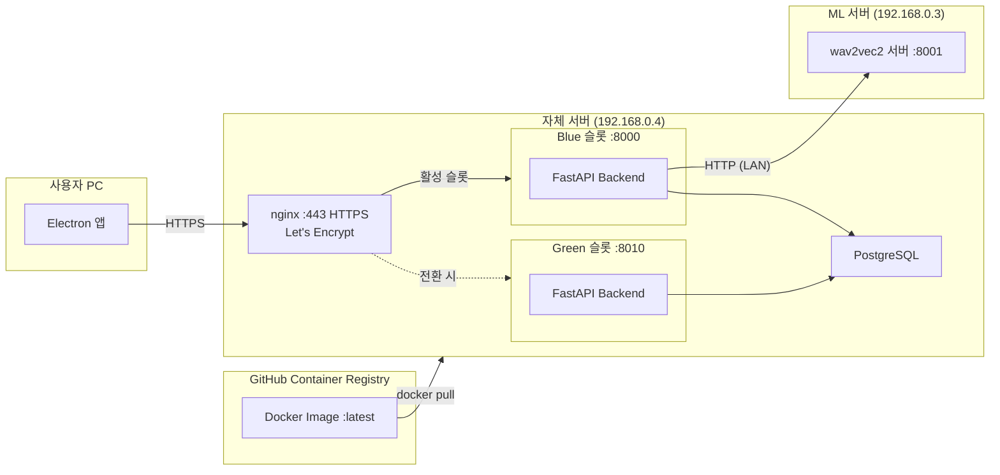

### 3.3 Blue-Green 배포 흐름

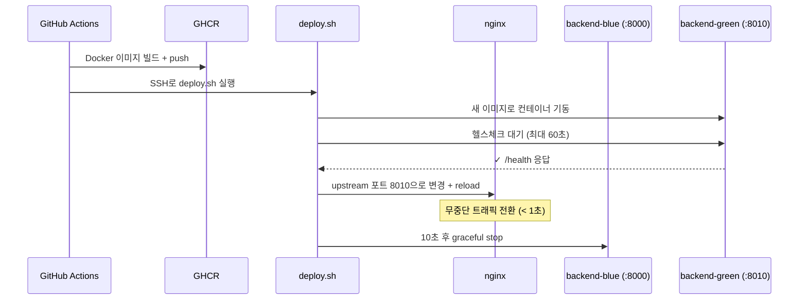

### 3.4 추천 파이프라인 시퀀스

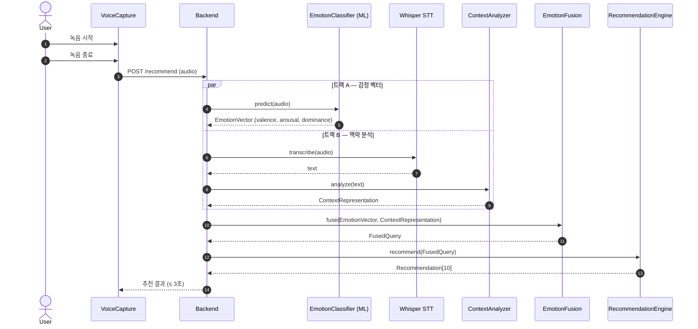

---

## 4. 주요 기능 구현

### 4.1 클라이언트 화면

#### 회원가입 / 로그인

| 회원가입 | 로그인 |
|---|---|
| 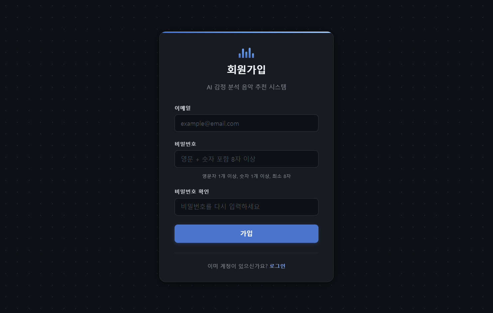 | 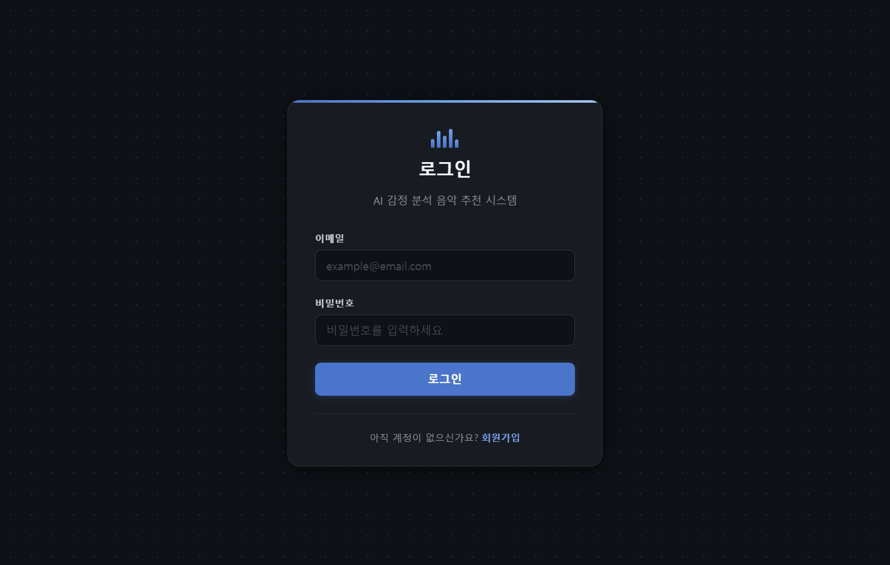 |

#### 음성 녹음 흐름

| 대기 화면 | 녹음 중 | 분석 중 |
|---|---|---|
| 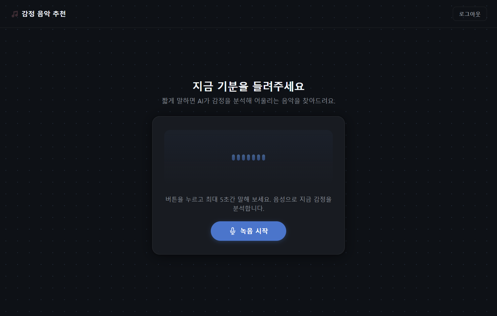 | 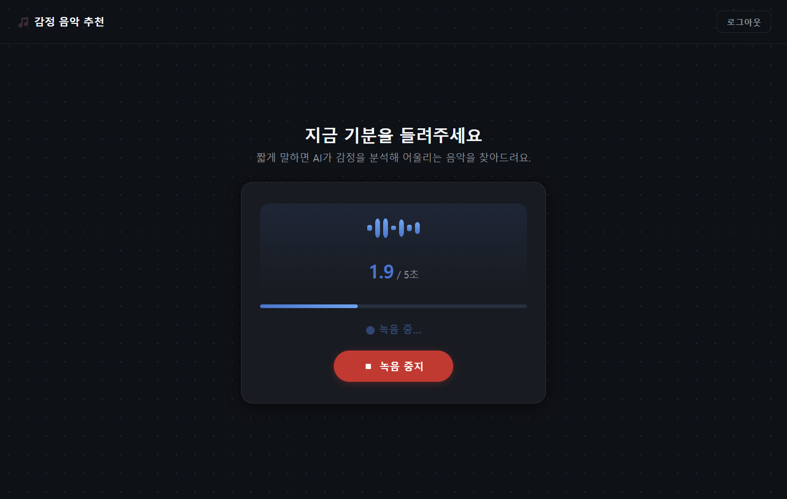 | 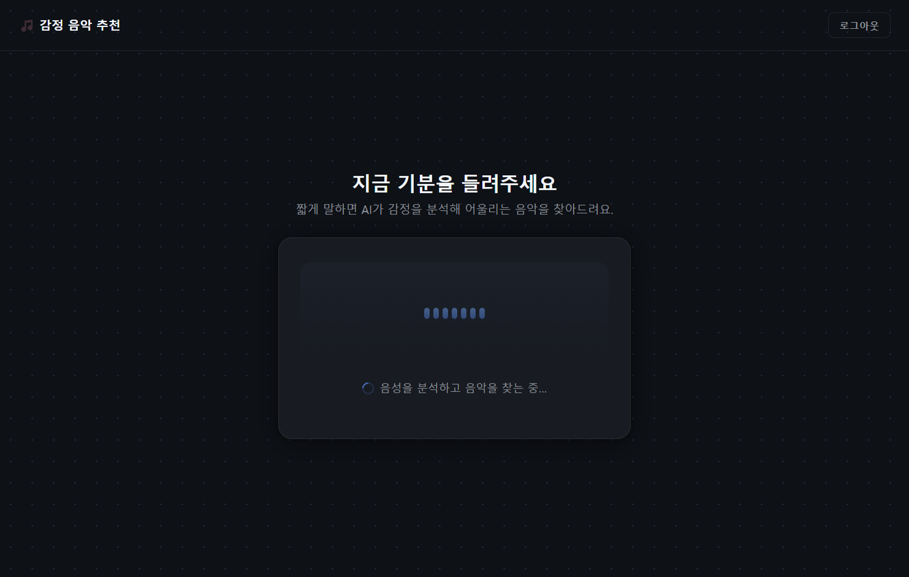 |

#### 추천 결과

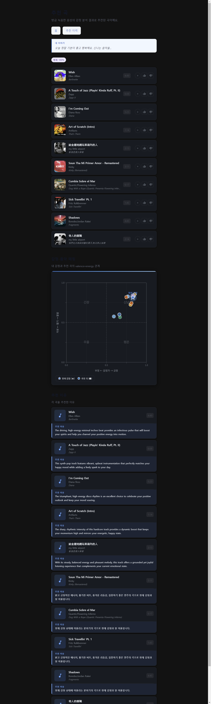

- **좌측**: 감정-음악 2D 매핑 차트 (Valence × Arousal)
- **우측**: 추천 곡 리스트 + LLM 추천 이유 카드

#### 추천 이력

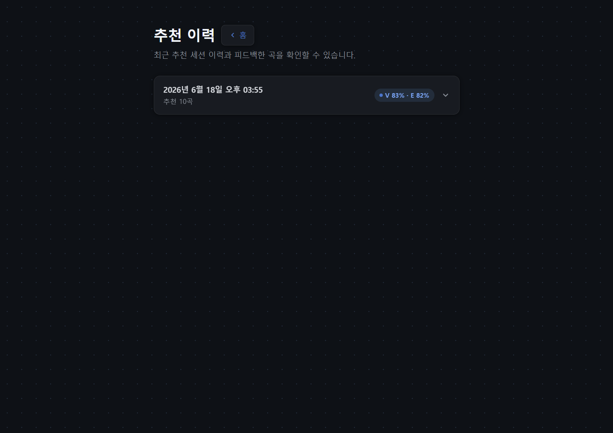

### 4.2 ML 서버 (EmotionClassifier)

- **모델**: facebook/wav2vec2-base → AI Hub 한국어 감정 음성 데이터셋으로 fine-tuning
- **입력**: 음성 오디오 바이트 (WAV/WebM)
- **출력**: 감정 레이블 + valence/arousal/dominance 벡터 + confidence 점수
- **서빙**: FastAPI 별도 서버 (192.168.0.3:8001), 데스크탑 GPU 활용
- **Fallback**: confidence 낮으면 neutral VAD 반환, ML 장애 시 서비스 중단 없음

### 4.3 Backend 추천 파이프라인

```
POST /recommend
  ├── asyncio.gather(
  │     EmotionClassifier.predict(audio),   # ML 트랙
  │     STTService.transcribe(audio)         # LLM 트랙
  │       → ContextAnalyzer.analyze(text)
  │   )
  ├── EmotionFusion.fuse(emotion, context)
  ├── RecommendationEngine.recommend(query)  # 코사인 유사도
  └── ReasonGenerator.generate(tracks)       # Gemini (트랙 수 제한으로 지연 완화)
```

**어댑터 패턴 (STTService)**: `STT_PROVIDER` 환경변수 하나로 `WhisperLocalAdapter` ↔ `WhisperApiAdapter` 교체 가능

**Fallback 전략**:
- LLM 장애 → 룰베이스 키워드 추출로 대체 (NFR2.3)
- ML 장애 / STT 실패 → 정상 트랙 결과만으로 응답, 서비스 중단 없음 (NFR2.4)

### 4.4 CI/CD 파이프라인

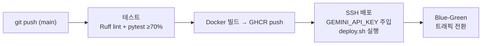

---

## 5. 비기능 요구사항 달성 현황

| NFR | 요구사항 | 달성 여부 | 비고 |
|---|---|---|---|
| NFR1.1 | 추천 응답 P95 ≤ 3초 | ✅ | 듀얼 트랙 병렬 처리 (asyncio.gather) |
| NFR1.3 | ML 추론 ≤ 1,500ms | ✅ | wav2vec2-base, GPU 서빙 |
| NFR2.2 | 무중단 배포 | ✅ | Blue-Green, nginx reload |
| NFR2.3 | LLM 장애 시 fallback | ✅ | 룰베이스 키워드 추출 |
| NFR2.4 | ML 장애 시 fallback | ✅ | neutral VAD + STT 실패 흡수 |
| NFR3.1 | HTTPS (TLS 1.2+) | ✅ | Let's Encrypt, nginx |
| NFR3.4 | 비밀번호 bcrypt | ✅ | cost=12, Alembic 마이그레이션 |
| NFR3.5 | API 키 환경변수 | ✅ | GitHub Secrets → 배포 시 .env 주입 |
| NFR4.3 | 감정 분류 정확도 ≥ 70% | ✅ | AI Hub 데이터 fine-tuning |
| NFR4.4 | 코드 커버리지 ≥ 70% | ✅ | pytest + vitest cov-fail-under=70 |
| NFR5.1 | ≤ 3 클릭으로 추천 | ✅ | 실행 → 녹음 → 결과 |
| NFR6.1 | 크로스플랫폼 (Win/Mac/Linux) | ✅ | electron-builder 3-OS 패키징 |

---

## 6. 소프트웨어 공학 적용 사례

### 6.1 아키텍처 패턴

| 패턴 | 적용 위치 | 목적 |
|---|---|---|
| 어댑터 패턴 | `STTService` | STT 백엔드 교체 가능성 확보 |
| SRP 컴포넌트 분리 | `EmotionFusion` | ML/LLM 트랙 독립 테스트 |
| props-only 컴포넌트 | `RecommendationVisualizer` | 차트/리스트/이유 카드 3분리 |
| 도메인 어댑터 | `toRecommendResult` | 백엔드 응답 shape 변경이 UI에 전파되지 않도록 격리 |

### 6.2 협업 프로세스

- **GitHub Flow**: feature 브랜치 → PR → 코드 리뷰 → 통합 브랜치 → main 머지
- **Conventional Commits**: `feat`, `fix`, `ci`, `test`, `perf`, `refactor` 타입 구분
- **이슈 트래킹**: MoSCoW 우선순위 라벨 (`prio/must`, `prio/should`, `prio/could`)
- **ADR**: 기술 선택 근거 문서화 (`docs/회의록/decisions/`)
- **Definition of Done**: 테스트 + lint + 커버리지 ≥ 70% + 리뷰 1명 승인

### 6.3 테스트 전략

| 계층 | 도구 | 범위 |
|---|---|---|
| 단위 테스트 | pytest | EmotionFusion, RecommendationEngine, 인증, 피드백 |
| 통합 테스트 | pytest + FastAPI TestClient | API 엔드포인트 전체 |
| ML 행동 테스트 | pytest (실서버) | 음성 극성 검증 (behavioral) |
| 클라이언트 | vitest | lib/, components/ 커버리지 게이트 |
| E2E | Electron + capture.js | 전체 플로우 자동 캡처 (실서버 연동) |

---

## 7. 트러블슈팅

### Backend

| 이슈 | 원인 | 해결 |
|---|---|---|
| CORS 500 응답에 헤더 누락 | `CORSMiddleware`가 예외 응답에 헤더를 못 붙임 | 미들웨어 순서 조정 + 예외 핸들러에서 헤더 명시 (PR #140) |
| 추천 점수 상한 버그 | 코사인 유사도 score 계산 시 이중 반올림 | round() 단일 적용 + DB 쓰기 경로 테스트 추가 (PR #144) |
| Dockerfile 빌드 오류 | `COPY data/` 대상인 `dataset.csv`가 .gitignore로 미추적 | dataset.csv git 추가 (PR #159) |
| STT/ML 장애 내성 비대칭 | ML 실패는 흡수하는데 STT 실패는 예외 전파 | STT 실패도 흡수하도록 통일 (PR #172) |
| Gemini 추천 이유 응답 지연 | 추천 곡 10개 전체에 LLM 호출 | 호출 트랙 수 제한으로 지연 완화 (PR #177) |

### Client

| 이슈 | 원인 | 해결 |
|---|---|---|
| logout 시 race condition | 로그아웃 요청과 페이지 이동 타이밍 겹침 | 요청 완료 후 이동으로 순서 보장 (PR #168) |
| iTunes 미리듣기·앨범아트 미노출 | Spotify API에 preview_url 없는 트랙 다수 | iTunes Search API fallback 추가 (PR #183) |
| CI flaky 504 오류 | Electron 바이너리 다운로드 타임아웃 | electron 바이너리 다운로드 스킵 + npm 캐시 (PR #c43) |
| JWT 만료 시 자동 갱신 실패 | `authedFetch`에 refresh 재시도 로직 미구현 | 401 감지 후 refresh → 1회 retry 추가 (PR #72) |

### Infra

| 이슈 | 원인 | 해결 |
|---|---|---|
| Blue-Green 최초 전환 다운타임 | old prod 컨테이너가 포트 8000 선점한 상태에서 트래픽 전환 전 정리 | 정리 시점을 트래픽 전환 후로 이동 (PR #176) |
| Blue-Green 컨테이너 네트워크 연결 오류 | `depends_on` 참조 서비스명 불일치 | 네트워크 설정 수정 (PR #98) |
| GEMINI_API_KEY 컨테이너 미주입 | deployer 경로 `.env`에 키 없음 | CI에서 GitHub Secret을 배포 시 `.env`에 자동 주입 |

---

## 8. 향후 개선 방향

- **추천 이유 스트리밍**: Gemini 응답을 SSE로 실시간 전송하여 체감 응답 속도 개선
- **피드백 기반 개인화**: 좋아요/싫어요 이력을 추천 가중치에 반영 (DB 기반 선호 프로필 구현 완료)
- **카탈로그 자동 동기화**: YouTube 감성 플레이리스트 → Spotify 매칭 스케줄러 운영
- **ML 모델 고도화**: wav2vec2-large 또는 한국어 특화 모델로 교체

---

## 참조 문서

| 문서 | 경로 |
|---|---|
| 시스템 요구사항 명세 (SRS v1) | `docs/회의록/design/srs-v1.md` |
| 아키텍처 개요 (4+1 뷰) | `docs/architecture-overview.md` |
| 기술 스택 카탈로그 | `docs/tech-stack-decision.md` |
| 시연 시나리오 | `docs/demo-scenario.md` |
| ADR-0001 (Electron 채택) | `docs/회의록/decisions/0001-electron-as-client-platform.md` |
| ADR-0002 (기술 스택) | `docs/회의록/decisions/0002-tech-stack.md` |
