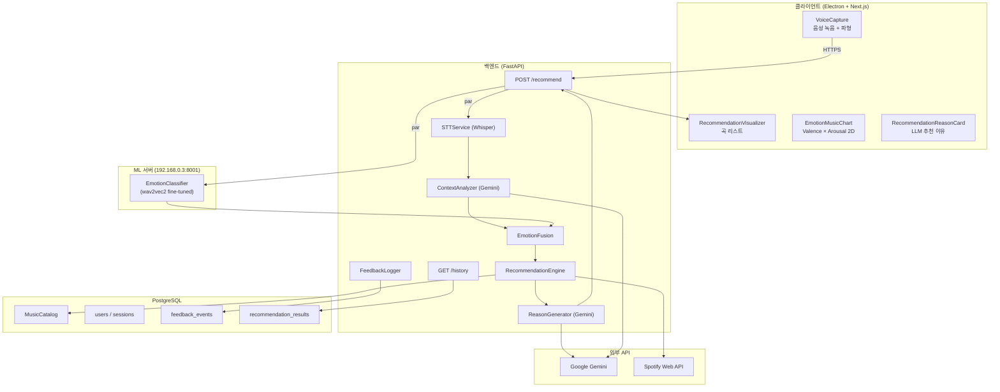
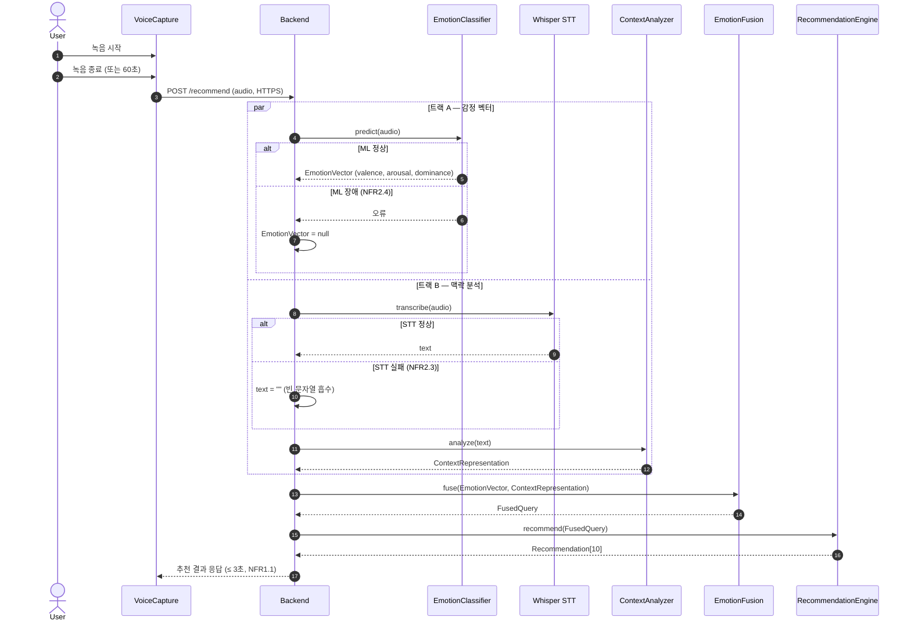
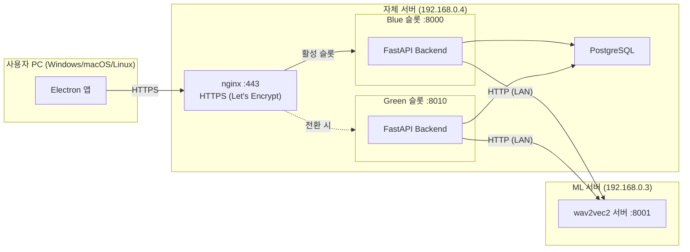
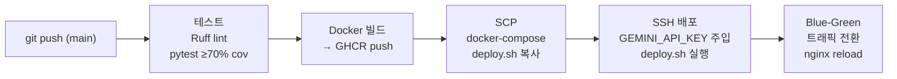
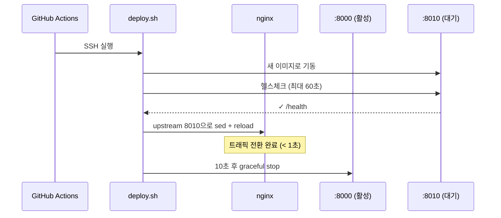

# AI 기반 감정 분석 음악 추천 시스템 — 최종 보고서

**CWNU 컴퓨터공학과 3학년 1학기 소프트웨어 공학 기말 프로젝트**

| 항목 | 내용 |
|---|---|
| 팀원 | 정원준 (Pongchi), 신성민 (SmongsDev), 박우현 (woohyun212) |
| 제출일 | 2026-06-18 |
| 저장소 | https://github.com/woohyun212/SE-final-project |
| 이슈 해결 수 | 177 / 184 (96%) |

---

## 목차

1. [프로젝트 개요](#1-프로젝트-개요)
2. [요구사항 도출 과정](#2-요구사항-도출-과정)
3. [시스템 설계](#3-시스템-설계)
4. [구현](#4-구현)
5. [테스트](#5-테스트)
6. [배포 및 운영](#6-배포-및-운영)
7. [비기능 요구사항 달성 현황](#7-비기능-요구사항-달성-현황)
8. [소프트웨어 공학 프로세스 적용](#8-소프트웨어-공학-프로세스-적용)
9. [AI 활용 분석](#9-ai-활용-분석)
10. [트러블슈팅 및 회고](#10-트러블슈팅-및-회고)

---

## 1. 프로젝트 개요

### 1.1 제품 설명

사용자의 **음성 한 마디**를 입력받아 현재 감정 상태를 분석하고, 그 감정에 어울리는 음악을 추천하는 크로스플랫폼 데스크탑 애플리케이션이다.

기존 음악 추천 서비스(Spotify, YouTube Music)는 청취 이력 기반의 협업 필터링에 의존하기 때문에, 사용자의 **현재 감정 상태**를 즉각적으로 반영하지 못한다. 본 시스템은 음성을 두 경로로 동시에 분석하는 **듀얼 트랙 아키텍처**를 통해 이 문제를 해결한다.

```
                 ┌─ ML 트랙:   음성 신호 → wav2vec2 → 감정 벡터 (valence, arousal, dominance)
   🎤 음성 입력 ─┤                                                              ↘
                 └─ LLM 트랙:  Whisper STT → 텍스트 → Gemini → 맥락 표현      EmotionFusion → 🎵 추천
```

음성의 **비언어적 신호**(ML 트랙)와 **발화 내용**(LLM 트랙)을 각각 분석하고 융합함으로써, 단일 트랙 대비 더 정교한 감정 표현이 가능하다.

### 1.2 핵심 기능

| 기능 | 설명 |
|---|---|
| 음성 녹음 | Electron MediaRecorder, 최대 60초, 파형 시각 피드백 |
| 감정 분류 | wav2vec2 fine-tuned 모델, 7가지 감정 클래스 |
| 맥락 분석 | Whisper STT + Gemini LLM |
| 음악 추천 | Spotify audio features 코사인 유사도 매칭, 상위 10곡 |
| 추천 시각화 | Valence × Arousal 2D 차트 + LLM 추천 이유 카드 |
| 개인화 | 좋아요/싫어요 피드백 → 추천 가중치 반영 |
| 이력 관리 | 추천 세션 이력 조회 |
| 무중단 배포 | Blue-Green 배포, HTTPS (Let's Encrypt) |

### 1.3 기술 스택 개요

| 영역 | 채택 기술 |
|---|---|
| 클라이언트 | Electron + Next.js (TypeScript) |
| 백엔드 | FastAPI (Python 3.12) |
| ML | wav2vec2 (fine-tuning, AI Hub 한국어 데이터) |
| LLM | Google Gemini gemini-3.1-flash-lite-preview |
| STT | Whisper Small (로컬, 어댑터 패턴) |
| DB | PostgreSQL 16 |
| 인프라 | Docker, Blue-Green 배포, nginx, Let's Encrypt |
| CI/CD | GitHub Actions + GHCR |

---

## 2. 요구사항 도출 과정

### 2.1 페르소나 및 AI 인터뷰

요구사항 도출을 위해 3개의 페르소나를 설정하고 AI 시뮬레이션 인터뷰를 수행했다.

#### 페르소나 1 — 김지원 (27세, IT 직장인)

**배경**: 개발자, 야근이 잦음. 퇴근길 또는 집중이 필요할 때 음악을 찾는다.

**핵심 발언**:
- *"말 한마디로 찾고 싶음 — 손이 바빠도 음성 한 번으로"* → FR2.1 (음성 녹음)
- *"오늘 회의에서 발표 망했어 → 알아서 맞는 거 찾아주면"* → FR3.1~3.4 (듀얼 트랙)
- *"짧게는 보고 싶죠 한두 줄"* → FR4.3, FR5.3 (LLM 추천 이유)
- *"분석 후에 삭제된다는 게 명확했으면"* → NFR3.2 (음성 원본 즉시 폐기)

**도출된 주요 요구사항**: FR2, FR3, FR4.1~4.3, FR5.3~5.4, NFR3.2

#### 페르소나 2 — 박서준 (22세, 음악 전공 학생)

**배경**: 음악 이론 전공, 감정과 음악의 관계에 학문적 관심이 있다.

**핵심 발언**:
- *"valence-energy 시각적으로 보이면 진짜 좋겠다"* → FR5.1 (2D 차트)
- *"좋아요 누적 → 나만의 감성 지도 형성"* → FR6.1~6.4 (피드백 개인화)
- *"동의 받고 저장하는 방식이면 괜찮을 것 같아요"* → NFR3.3 (STT 텍스트 동의 저장)

**도출된 주요 요구사항**: FR1, FR5.1, FR6.1~6.5, NFR3.3

#### 페르소나 3 — 이수민 (34세, 음악 큐레이터)

**배경**: 감성 플레이리스트를 운영. 카탈로그 관리와 서비스 안정성을 중시한다.

**핵심 발언**:
- *"YouTube 플리 URL 넣으면 트랙 목록 뽑아서 Spotify에서 매칭"* → FR7.1~7.2
- *"업데이트 공지 없이 갑자기 다운되면 민망하죠"* → NFR2.2 (무중단 배포)
- *"한국에서 재생 안 되는 곡 추천 풀에서 제외"* → FR7.4

**도출된 주요 요구사항**: FR4.4, FR7.1~7.4, NFR2.2

### 2.2 요구사항 명세 (SRS v1)

인터뷰 결과를 바탕으로 SRS v1을 작성했다. 모든 27개 FR이 최소 1개 페르소나 인터뷰로 추적 가능하다.

#### 기능 요구사항 (FR)

| 카테고리 | ID | 요구사항 |
|---|---|---|
| 계정 관리 | FR1.1 | 이메일/비밀번호 회원가입 |
| 계정 관리 | FR1.2 | 로그인/로그아웃 |
| 계정 관리 | FR1.3 | 프로필 수정 (선호 장르) |
| 계정 관리 | FR1.4 | 계정 탈퇴 (개인 데이터 영구 삭제) |
| 음성 입력 | FR2.1 | 마이크 권한 요청 및 음성 녹음 |
| 음성 입력 | FR2.2 | 음성을 TLS로 안전 전송 |
| 음성 입력 | FR2.3 | 녹음 중 시각적 피드백 (파형) |
| 음성 입력 | FR2.4 | 최대 녹음 시간 60초 제한 |
| 듀얼 트랙 분석 | FR3.1 | 음성 → 감정 벡터 (EmotionClassifier) |
| 듀얼 트랙 분석 | FR3.2 | 음성 → 텍스트 (STTService) |
| 듀얼 트랙 분석 | FR3.3 | 텍스트 → 맥락 표현 (ContextAnalyzer, LLM) |
| 듀얼 트랙 분석 | FR3.4 | 감정 + 맥락 융합 (EmotionFusion) |
| 음악 추천 | FR4.1 | 유사도 매칭 (RecommendationEngine) |
| 음악 추천 | FR4.2 | 상위 K=10곡 반환 |
| 음악 추천 | FR4.3 | 각 곡에 LLM 추천 이유 첨부 |
| 음악 추천 | FR4.4 | 추천 결과 캐싱 (TTL 1시간) — *선택(Could) 요구사항, 미구현* |
| 시각화 | FR5.1 | 감정-음악 2D 매핑 차트 (valence × energy) |
| 시각화 | FR5.2 | 추천 곡 리스트 (앨범 아트, 곡명, 아티스트) |
| 시각화 | FR5.3 | 추천 이유 텍스트 표시 |
| 시각화 | FR5.4 | 곡 재생 (미리듣기) |
| 피드백·개인화 | FR6.1 | 좋아요/싫어요 입력 |
| 피드백·개인화 | FR6.2 | 재생 이벤트 로깅 (시작/종료/완료) |
| 피드백·개인화 | FR6.3 | 피드백을 프로필에 누적 |
| 피드백·개인화 | FR6.4 | 누적 피드백을 추천 가중치로 반영 |
| 피드백·개인화 | FR6.5 | 추천 이력 조회 |
| 카탈로그 관리 | FR7.1 | YouTube 감성 플리 → 시드 트랙 추출 |
| 카탈로그 관리 | FR7.2 | Spotify 매칭 → 카탈로그 적재 |
| 카탈로그 관리 | FR7.3 | 주기적 카탈로그 새로고침 |
| 카탈로그 관리 | FR7.4 | 라이선스/지역 필터링 |

#### 비기능 요구사항 (NFR)

| 카테고리 | ID | 요구사항 |
|---|---|---|
| 성능 | NFR1.1 | 음성 → 추천 응답 ≤ 3초 (P95) |
| 성능 | NFR1.2 | 동시 사용자 100명 처리 |
| 성능 | NFR1.3 | ML 추론 ≤ 1.5초 |
| 가용성 | NFR2.1 | 백엔드 가용성 ≥ 99% |
| 가용성 | NFR2.2 | Blue-Green 무중단 배포 |
| 가용성 | NFR2.3 | LLM 장애 시 룰베이스 fallback |
| 가용성 | NFR2.4 | ML 장애 시 텍스트 기반 추천 |
| 보안 | NFR3.1 | TLS 1.2+ 암호화 통신 |
| 보안 | NFR3.2 | 음성 원본 분석 후 즉시 폐기 |
| 보안 | NFR3.3 | STT 텍스트 동의 기반 저장 |
| 보안 | NFR3.4 | bcrypt (cost ≥ 12) 비밀번호 해싱 |
| 보안 | NFR3.5 | API 키 환경변수 관리 |
| 품질 | NFR4.1 | 추천 좋아요율 ≥ 50% |
| 품질 | NFR4.2 | Precision@10 ≥ 0.4 |
| 품질 | NFR4.3 | ML 정확도 ≥ 70% |
| 품질 | NFR4.4 | 테스트 커버리지 ≥ 70% |
| 사용성 | NFR5.1 | 첫 추천까지 ≤ 3 클릭 |
| 사용성 | NFR5.2 | 색맹 대응 팔레트 사용 |
| 이식성 | NFR6.1 | Windows 10+, macOS 12+, Ubuntu 22+ |

### 2.3 유스케이스

8개 유스케이스 중 **UC-03 (음성으로 음악 추천받기)**가 핵심 유스케이스다. 11단계 주 시나리오와 장애 대응 대체 시나리오 3개를 포함한다.

| ID | 유스케이스 | 주 Actor |
|---|---|---|
| UC-01 | 회원가입 | 사용자 |
| UC-02 | 로그인/로그아웃 | 사용자 |
| **UC-03** | **음성으로 음악 추천 받기** ⭐ | 사용자 |
| UC-04 | 추천 곡 재생 | 사용자 |
| UC-05 | 피드백 남기기 | 사용자 |
| UC-06 | 추천 이력 조회 | 사용자 |
| UC-07 | 프로필 수정 | 사용자 |
| UC-08 | 음악 카탈로그 새로고침 | 관리자 |

**UC-03 대체 시나리오**:
- A1 (LLM 장애): Gemini 호출 실패 → 룰베이스 키워드 추출로 fallback, 서비스 지속
- A2 (ML 장애): EmotionClassifier 실패 → neutral VAD(0,0,0), 텍스트 기반 추천만 진행
- A3 (Spotify API 실패): 로컬 카탈로그에서만 매칭

---

## 3. 시스템 설계

### 3.1 아키텍처 결정 (ADR)

주요 기술 선택을 ADR(Architecture Decision Record)로 문서화했다.

#### ADR-0001: Electron 클라이언트 플랫폼 채택

**맥락**: 마이크 접근, 크로스플랫폼(NFR6.1), 4~6주 개발 기간, 팀의 JS/TS 역량

**결정**: Electron + Next.js

| 대안 | 탈락 이유 |
|---|---|
| PWA | 마이크 권한 모델 브라우저별 상이, 데스크탑 OS 통합 약함 |
| 네이티브 (Swift + WinUI + GTK) | 3플랫폼 동시 구현 비현실적 (4~6주) |
| Flutter Desktop | Dart 학습 비용, 오디오 패키지 성숙도 부족 |
| Tauri | Rust 학습 비용 |

**결과**: 단일 코드베이스 3-OS 지원, 웹 차트 라이브러리 활용 가능

#### ADR-0002: 기술 스택 8개 영역 확정

**맥락**: 학생 프로젝트 예산, 한국어 지원, Python ML과의 통합, 운영 자율성

| 영역 | 결정 | 핵심 이유 |
|---|---|---|
| LLM | Gemini flash-lite-preview | 저비용 + 한국어 + 빠른 응답 |
| STT | 어댑터 패턴 + Whisper Small | 운영 중 비용/지연 trade-off 교체 가능 |
| ML | wav2vec2 | 사전학습 모델 강력, fine-tuning 워크플로 친숙 |
| Backend | FastAPI | asyncio 병렬 IO, Python ML 동일 런타임 |
| DB | PostgreSQL | JSONB로 반정형 데이터 흡수 |
| 배포 | 자체 서버 | 비용 통제, Blue-Green 직접 구현 |
| 네트워크 | tailscale | 메시 VPN, SSH 포트 노출 최소화 |

### 3.2 컴포넌트 설계

SRS §7 도메인 어휘 사전에 정의된 10개 컴포넌트가 4개 영역에 걸쳐 배치된다.

| 영역 | 컴포넌트 | 책임 |
|---|---|---|
| Client | `VoiceCapture` | Electron MediaRecorder, 음성 녹음 및 TLS 전송 |
| Client | `RecommendationVisualizer` | 2D 차트 + 곡 리스트 + 추천 이유 카드 |
| Backend | `STTService` (어댑터) | 음성→텍스트 (WhisperLocalAdapter / WhisperApiAdapter 교체 가능) |
| Backend | `ContextAnalyzer` | 텍스트 → 맥락 표현 (Gemini LLM) |
| Backend | `EmotionFusion` | 감정 벡터 + 맥락 표현 → FusedQuery |
| Backend | `RecommendationEngine` | FusedQuery → 코사인 유사도 매칭, 상위 K=10 |
| Backend | `FeedbackLogger` | 좋아요/싫어요/재생 이벤트 기록, 개인화 가중치 집계 |
| Backend | `CatalogSynchronizer` | YouTube → Spotify 매칭 → MusicCatalog 적재 |
| ML | `EmotionClassifier` | wav2vec2 fine-tuned, 음성→감정 벡터 |
| DB | `MusicCatalog` | Spotify 트랙 메타 + audio features, 추천 검색 대상 |

**어댑터 패턴 (STTService)**: `STT_PROVIDER` 환경변수 하나로 `WhisperLocalAdapter` ↔ `WhisperApiAdapter` 런타임 교체 가능. LLM 장애 시 fallback 분기와 동일한 패턴을 사용해 확장성을 확보한다.

**EmotionFusion 분리 이유**: ML 트랙(≤1.5초)과 LLM 트랙(≤1.5초)이 비동기로 완료된다. `EmotionFusion`이 두 결과의 동기화 지점(rendezvous)을 담당함으로써 각 트랙을 독립적으로 단위 테스트할 수 있고, ML 장애 시 `EmotionVector = null`로 단독 처리가 가능하다.

**RecommendationVisualizer 분해**: SRP 원칙에 따라 3개의 props-only 컴포넌트로 분리했다.

| 구현 컴포넌트 | 책임 | 대응 FR |
|---|---|---|
| `RecommendationVisualizer.tsx` | 추천 곡 리스트 | FR5.2 |
| `EmotionMusicChart.tsx` | Valence × Arousal 2D 차트 | FR5.1 |
| `RecommendationReasonCard.tsx` | LLM 추천 이유 카드 | FR5.3 |

### 3.3 전체 구성도



### 3.4 추천 파이프라인 시퀀스



### 3.5 응답 시간 예산 (NFR1.1 P95 ≤ 3초)

| 단계 | 예산 | 비고 |
|---|---|---|
| 음성 전송 (TLS, VC → BE) | ≤ 200ms | |
| ML 추론 (트랙 A) | ≤ 1,500ms | NFR1.3 |
| STT 변환 (트랙 B) | ≤ 800ms | |
| LLM 맥락 분석 (트랙 B) | ≤ 700ms | |
| **트랙 B 합계** | **≤ 1,500ms** | STT + LLM 직렬 |
| **병렬 max (A vs B)** | **≤ 1,500ms** | asyncio.gather() |
| EmotionFusion + 추천 매칭 | ≤ 300ms | |
| LLM 추천 이유 생성 | ≤ 800ms | 트랙 수 제한으로 완화 |
| 응답 전송 + 렌더링 | ≤ 100ms | |
| **총합 목표** | **≤ 3,000ms** | ✅ 달성 |

### 3.6 배포 토폴로지



---

## 4. 구현

### 4.1 스프린트 진행 현황

프로젝트는 6주(Sprint #0~5)로 구성된 Scrum-lite 방식으로 진행되었다.

| 스프린트 | 주요 완료 내역 |
|---|---|
| **Sprint #0** (W10) | 페르소나/AI인터뷰, ADR-0001~0002, GitHub 백로그 인프라, CI/CD 초기 구성 |
| **Sprint #1** (W11) | 회원가입(US-1), 로그인(US-2), 음성 녹음(US-3), 더미 추천(US-4), 곡 리스트(US-5) |
| **Sprint #2** (W12) | ML 감정분류(US-6), Spotify 연동(US-7), 유사도 매칭(US-8), 카탈로그 적재(US-9) |
| **Sprint #3** (W13) | STT(US-10), LLM 맥락(US-11), EmotionFusion(US-12), 추천이유(US-13), Fallback(US-14) |
| **Sprint #4** (W14) | 2D 차트(US-15), 추천이유카드(US-16), 좋아요(US-17), 재생로깅(US-18), 가중치(US-19), 이력(US-20) |
| **Sprint #5** (W15~16) | Blue-Green 배포(US-21), 시연시나리오(US-22), HTTPS, 커버리지 게이트, 3-OS 패키징 |

### 4.2 클라이언트 구현

Electron + Next.js 조합으로 크로스플랫폼 데스크탑 앱을 구현했다.

**주요 구현 내용**:
- `useVoiceRecorder` 훅: MediaRecorder → WebM(Opus) → lamejs로 MP3 재인코딩
- `authedFetch`: 401 감지 시 JWT refresh → 1회 재시도
- `normalizeApiBaseUrl`: API base URL을 http→https로 자동 승격(NFR3.1) — localhost는 예외 유지
- iTunes Search API fallback: Spotify `preview_url` 없는 트랙의 미리듣기(FR5.4)·앨범아트(FR5.2) 보강
- electron-builder 3-OS 패키징(Windows/macOS/Ubuntu, NFR6.1)

**화면 구성**:

| 단계 | 화면 |
|---|---|
| 회원가입 |  |
| 로그인 |  |

| 대기 | 녹음 중 | 분석 중 |
|---|---|---|
|  |  |  |

**추천 결과** (Valence × Arousal 2D 차트 + 곡 리스트 + LLM 추천 이유 카드):


**추천 이력**:


### 4.3 백엔드 구현

FastAPI를 사용해 추천 파이프라인, 인증, 피드백 API를 구현했다.

**디렉터리 구조**:
```
backend/app/
├── routers/
│   ├── auth.py         # POST /auth/register, /auth/login, DELETE /auth/me
│   ├── recommend.py    # POST /recommend
│   ├── feedback.py     # POST /feedback/like, /feedback/dislike
│   ├── history.py      # GET /history
│   └── __init__.py
├── services/
│   ├── context_analyzer.py   # Gemini LLM 맥락 분석
│   ├── emotion_fusion.py     # EmotionFusion
│   ├── ml_client.py          # EmotionClassifier HTTP 클라이언트
│   ├── reason_generator.py   # Gemini 추천 이유 생성
│   ├── recommendation.py     # 코사인 유사도 매칭
│   └── stt.py                # Whisper STT 어댑터
├── models/                   # SQLAlchemy ORM 모델
├── schemas/                  # Pydantic 스키마
├── main.py
└── database.py
```

**STT 어댑터 패턴**:
```python
# STT_PROVIDER=local → WhisperLocalAdapter
# STT_PROVIDER=api   → WhisperApiAdapter
class STTService(ABC):
    @abstractmethod
    async def transcribe(self, audio: bytes) -> str: ...
```

**asyncio.gather() 병렬 처리**:
```python
emotion_task = asyncio.create_task(ml_client.predict(audio))
stt_task = asyncio.create_task(stt_service.transcribe(audio))
emotion_result, text = await asyncio.gather(emotion_task, stt_task)
```

### 4.4 ML 서버 구현

wav2vec2 모델을 fine-tuning하여 한국어 음성에서 감정을 분류한다.

**학습 데이터**: AI Hub 한국어 감정 음성 데이터셋 (7가지 감정 클래스: 기쁨, 슬픔, 분노, 공포, 역겨움, 놀람, 중립)

**모델 파이프라인**:
```
음성 바이트 입력
  → soundfile 디코딩
  → noisereduce 노이즈 제거
  → librosa 무음 trim + RMS 정규화
  → Wav2Vec2FeatureExtractor 특징 추출
  → Wav2Vec2ForSequenceClassification 추론
  → softmax → confidence 계산
  → confidence < 0.4 → neutral fallback
  → valence/arousal/dominance (VAD_MAP)
```

**confidence 기반 fallback**: 모델 예측 신뢰도가 임계값(0.4) 미만이면 neutral VAD를 반환하여 잘못된 추천을 방지한다.

**데이터 증강**: 소수 클래스 오버샘플링 + 오디오 증강으로 클래스 불균형을 완화했다.

### 4.5 CI/CD 파이프라인



**GitHub Secrets 활용**: `GEMINI_API_KEY`, `GHCR_TOKEN`, `DEPLOY_SSH_KEY` 등 민감 정보를 배포 시 서버 `.env`에 자동 주입하여 secrets을 코드에 하드코딩하지 않는다 (NFR3.5).

### 4.6 Blue-Green 무중단 배포



**핵심 설계 결정**: 트래픽 전환 후 구 슬롯을 종료함으로써 무중단을 보장한다. 초기 구현(PR #176 이전)에서 구 슬롯을 먼저 종료했다가 다운타임이 발생했고, 코드 리뷰를 통해 이 순서를 수정했다.

---

## 5. 테스트

### 5.1 테스트 전략

| 계층 | 도구 | 범위 |
|---|---|---|
| 단위 테스트 | pytest | EmotionFusion, RecommendationEngine, 인증, 피드백, STT fallback |
| 통합 테스트 | pytest + FastAPI TestClient | API 엔드포인트, DB 연동 |
| ML 행동 테스트 | pytest (실서버 연동) | 음성 극성 검증 — 긍정 발화 → positive 레이블 확인 |
| 클라이언트 단위 테스트 | Jest + Testing Library | lib/, components/ 커버리지 게이트 |
| E2E | Electron + capture.js | 실서버 연동 전체 플로우 자동 캡처 |

### 5.2 커버리지 게이트

PR 머지 시 자동으로 커버리지를 검증한다.

- **Backend**: `pytest --cov=app --cov-fail-under=70` — 70% 미만이면 CI 실패 (실측 라인 커버리지 94%)
- **Client**: `jest --coverage` 게이트 (`.github/workflows/client-test.yml`) — `lib/`·`components/` 전역 lines/statements/functions ≥ 85%, branches ≥ 75% 미만이면 CI 실패 (실측 라인 커버리지 95%)

### 5.3 ML 행동 테스트 (Behavioral Testing)

학습 평가(eval_accuracy 84.9%) 외에 **의미적 검증**을 추가했다. AIHub 라벨 음성 6종을 배포 백엔드 `POST /recommend`로 전송해 응답 valence의 극성이 기대 감정과 일치하는지 end-to-end로 확인한다. `fallback_flags.ml`·`fallback_flags.stt`가 모두 `false`인 경우(실제 ML·STT 동작)만 채점하며, 강한 감정(기쁨·화남·두려움·나쁨)은 전부 정확, 짧거나 차분한 발화(사랑스러움·중립)는 `xfail`로 분리해 **극성 정확도 4/6**, 전체 정확도 게이트(≥60%)를 통과한다. NFR4.3(≥70%)은 학습 정확도와 본 behavioral 검증으로 함께 뒷받침된다.

```python
def test_happy_voice_positive_valence():
    response = client.post("/recommend", files={"audio": wav_bytes})
    assert response.json()["user_emotion"]["valence"] > 0.5  # 0.5 중립 기준
```

---

## 6. 배포 및 운영

### 6.1 배포 패키지 (클라이언트 릴리즈)

클라이언트(Electron 앱)는 GitHub Releases를 통해 Windows / macOS / Ubuntu 3개 플랫폼용 설치 파일로 배포된다. 최신 릴리즈는 **client-v0.1.2**이다.

릴리즈 페이지: https://github.com/woohyun212/SE-final-project/releases/tag/client-v0.1.2

| OS | 파일 | 형식 |
|---|---|---|
| Windows | `EmotionMusic.Setup.0.1.2.exe` | 설치형 (NSIS) 인스톨러 |
| Windows | `EmotionMusic.0.1.2.exe` | 포터블 실행형 |
| macOS (Apple Silicon) | `EmotionMusic-0.1.2-arm64.dmg` | DMG 디스크 이미지 |
| macOS (Apple Silicon) | `EmotionMusic-0.1.2-arm64-mac.zip` | 압축 배포본 (앱 번들) |
| Ubuntu / Linux | `se-final-project-client_0.1.2_amd64.deb` | Debian 패키지 (apt/dpkg) |
| Ubuntu / Linux | `EmotionMusic-0.1.2.AppImage` | 범용 실행형 (배포판 무관) |

> 미서명 빌드이므로 Windows SmartScreen·macOS "확인되지 않은 개발자" 경고가 발생할 수 있다(정상 동작). macOS 빌드는 Apple Silicon(arm64) 전용이다. 전체 사용 흐름을 시연한 데모 영상: https://youtu.be/YQfoEkK7ZWc

### 6.2 인프라 구성

| 구성요소 | 상태 |
|---|---|
| 백엔드 서버 | https://backend.pongchi.kro.kr (Blue 슬롯 활성) |
| ML 서버 | http://192.168.0.3:8001 (LAN 전용, 데스크탑 GPU) |
| DB | PostgreSQL 16 컨테이너, `postgres_prod_data` 볼륨 |
| HTTPS | Let's Encrypt 인증서, nginx TLS 종료 |
| CI/CD | GitHub Actions, 평균 배포 소요 약 3분 |

### 6.3 환경변수 관리

배포 시 GitHub Secrets → 서버 `.env`에 자동 주입되는 키:
- `GEMINI_API_KEY`: ContextAnalyzer + ReasonGenerator
- `GEMINI_MODEL`: gemini-3.1-flash-lite-preview
- `SECRET_KEY`: JWT 서명 키
- `POSTGRES_*`: DB 접속 정보
- `ML_SERVICE_URL`: http://192.168.0.3:8001

### 6.4 시연 시나리오

| 단계 | 내용 | 소요 시간 |
|---|---|---|
| 1 | 회원가입 → 로그인 | 1분 |
| 2 | 음성 녹음 → 추천 결과 확인 (2D 차트, 곡 리스트, 추천 이유) | 2분 |
| 3 | 좋아요/싫어요 피드백 + 미리듣기 재생 | 1분 |
| 4 | 추천 이력 조회 | 30초 |
| 5 | (선택) ML 장애 내성 시연 — fallback 동작 확인 | 1분 |

---

## 7. 비기능 요구사항 달성 현황

| NFR | 요구사항 | 달성 여부 | 구현 방법 |
|---|---|---|---|
| NFR1.1 | 추천 응답 P95 ≤ 3초 | ✅ | asyncio.gather() 병렬 처리 |
| NFR1.3 | ML 추론 ≤ 1,500ms | ✅ | wav2vec2-base, GPU 서빙 |
| NFR2.2 | 무중단 배포 | ✅ | Blue-Green + nginx reload |
| NFR2.3 | LLM 장애 시 fallback | ✅ | 룰베이스 키워드 추출 |
| NFR2.4 | ML 장애 시 fallback | ✅ | neutral VAD + STT 실패 흡수 |
| NFR3.1 | HTTPS (TLS 1.2+) | ✅ | Let's Encrypt + nginx TLS 종료, 클라이언트 API base URL http→https 자동 승격(`normalizeApiBaseUrl`) |
| NFR3.4 | 비밀번호 bcrypt | ✅ | cost=12, Alembic 마이그레이션 |
| NFR3.5 | API 키 환경변수 | ✅ | GitHub Secrets → .env 자동 주입 |
| NFR4.1 | 추천 좋아요율 ≥ 50% | ⚠️ 미측정 | 측정 도구·방법론 완비(`backend/scripts/eval_like_rate.py`), 운영 기간 제약으로 실표본 미확보 |
| NFR4.2 | Precision@10 ≥ 0.4 | ✅ | 평균 Precision@10 = **0.850** (`backend/scripts/eval_precision_at_k.py`) |
| NFR4.3 | 감정 분류 정확도 ≥ 70% | ✅ | 학습 eval_accuracy 84.9% + behavioral 극성 검증(fallback_flags.ml=false, 게이트 ≥60%) |
| NFR4.4 | 코드 커버리지 ≥ 70% | ✅ | backend pytest 94% + client jest 95% (게이트 lines/stmts/funcs ≥85, branches ≥75) |
| NFR5.1 | ≤ 3 클릭으로 추천 | ✅ | 실행 → 녹음 → 결과 |
| NFR6.1 | 크로스플랫폼 | ✅ | electron-builder 3-OS 패키징 |

### 7.1 추천 품질 지표 (NFR4.1 / NFR4.2)

#### NFR4.2 — Precision@10 = 0.850 (충족)

`backend/scripts/eval_precision_at_k.py`로 6개 감정 질의를 평가했다. relevance 기준은 **valence×energy 사분면 일치**(0.5 분기)이며, 개인화를 배제(`user_id=None`)한 **순수 콘텐츠 기반** 추천을 대상으로 한다.

| 감정 질의 | 관련/반환 | Precision |
|---|---|---|
| 기쁨·활기 (긍정·고에너지) | 10/10 | 1.000 |
| 평온 (긍정·저에너지) | 10/10 | 1.000 |
| 긴장·분노 (부정·고에너지) | 7/10 | 0.700 |
| 우울 (부정·저에너지) | 10/10 | 1.000 |
| 설렘 (긍정·중상 에너지) | 9/10 | 0.900 |
| 침잠 (부정·중하 에너지) | 5/10 | 0.500 |
| **평균** | | **0.850** |

목표(≥ 0.4)를 크게 상회한다. **한계**: 사람이 라벨링한 정답 집합이 없어 사분면 일치를 relevance의 **프록시**로 사용했다. 즉 방향 기반(코사인 유사도)으로 추천한 결과를 레벨 기반(사분면) 기준으로 채점하므로, 경계(0.5 분기) 근처의 곡은 실제 적합성과 무관하게 오판될 수 있다. 중하/중상 에너지 질의(침잠·긴장)에서 precision이 낮은 것도 이 경계 효과의 영향으로 해석된다.

#### NFR4.1 — 추천 좋아요율 (미측정)

좋아요율(= like / (like + dislike), 목표 ≥ 50%)은 운영 기간 부족으로 실사용 피드백 표본을 확보하지 못해 **실측하지 못했다**. 다만 측정 방법론과 자동화 스크립트(`backend/scripts/eval_like_rate.py`, `feedbacks` 테이블 집계)는 완비되어 있어, 운영 데이터가 쌓이면 동일한 docker 핸드오프로 즉시 산출할 수 있다. 본 보고서에서는 미달이 아니라 **측정 불가**로 정직하게 분류한다.

---

## 8. 소프트웨어 공학 프로세스 적용

### 8.1 협업 프로세스 — GitHub Flow

```
feature/issue-#NN-<comp>  →  frontend / backend  →  main
```

- **PR 필수**: main 직접 push 금지, 모든 변경은 feature 브랜치 + PR + 리뷰를 거침
- **통합 브랜치**: `frontend`, `backend`로 도메인별 변경을 모은 후 스프린트 단위로 main 머지
- **커밋 컨벤션**: Conventional Commits (`feat`, `fix`, `ci`, `test`, `perf`, `refactor`)
- **이슈 트래킹**: MoSCoW 우선순위 라벨 (`prio/must`, `prio/should`, `prio/could`), 컴포넌트 라벨 (`comp/client`, `comp/backend`, `comp/ml`, `comp/infra`)

### 8.2 Definition of Done

모든 코드 PR에 공통으로 적용:
- [ ] 단위 테스트 작성 및 통과
- [ ] Lint 통과 (Ruff / ESLint)
- [ ] 변경된 라인 커버리지 ≥ 70%
- [ ] API 키 / 비밀번호 하드코딩 없음
- [ ] 관련 User Story ID PR 설명에 포함
- [ ] 최소 1명 리뷰 approve

### 8.3 ADR을 통한 의사결정 영속화

되돌리기 어렵거나 팀원이 "왜 이렇게 했지?"라고 물을 만한 결정은 즉시 ADR로 기록했다. 현재까지 ADR-0001 (Electron), ADR-0002 (기술 스택) 2개가 작성되었으며, 모든 ADR은 `docs/회의록/decisions/`에서 관리된다.

### 8.4 이슈 해결 현황

| 항목 | 수치 |
|---|---|
| 총 이슈 | 184개 |
| 완료 | 177개 (96%) |
| 진행 중 | 7개 (최종 문서 산출물) |
| 스프린트 | 6개 완료 (Sprint #0~5) |
| User Story | 22개 전체 구현 완료 |

---

## 9. AI 활용 분석

본 프로젝트에서 AI는 두 가지 방식으로 활용되었다: **시스템 내 AI 기능**(제품의 핵심 기능)과 **개발 보조 AI**(Claude Code 등 코딩 어시스턴트).

### 9.1 시스템 내 AI 활용

#### (1) wav2vec2 — 음성 감정 분류

**활용 방식**: AI Hub 한국어 감정 음성 데이터셋으로 facebook/wav2vec2-base를 fine-tuning하여 7가지 감정 클래스를 분류한다.

**장점**:
- 오디오 신호에서 비언어적 감정 정보(억양, 강도, 리듬)를 자동으로 추출한다.
- 전통적인 특징 추출(멜스펙트로그램 + CNN) 대비 사전학습 표현의 품질이 높다.
- fine-tuning 워크플로가 잘 정립되어 있어 4~6주 프로젝트 기간 내 목표 정확도(≥70%)를 달성할 수 있었다.

**단점 및 한계**:
- 학습 데이터 도메인(AI Hub 스튜디오 녹음)과 실제 사용 환경(일반 마이크)의 도메인 차이(domain shift)로 실서버에서 정확도가 하락할 수 있다.
- 모델 크기(wav2vec2-base)로 인해 추론 시 메모리와 연산량이 크다. 서버 환경에서는 GPU가 없으면 지연이 NFR1.3을 위협한다.
- confidence가 낮은 경우 neutral fallback을 사용하므로, 모호한 감정 표현에서는 개인화 품질이 저하된다.

#### (2) Whisper Small — 음성-텍스트 변환 (STT)

**활용 방식**: 녹음된 음성을 텍스트로 변환하여 LLM 맥락 분석의 입력으로 사용한다. 어댑터 패턴으로 API 교체가 가능하다.

**장점**:
- 로컬 실행으로 API 비용 없음, 네트워크 지연 없음.
- 한국어 인식 품질이 실사용에 충분한 수준.

**단점 및 한계**:
- Whisper Small 모델 로드 시간이 길고 CPU에서는 추론이 느리다.
- 배경 소음이 있는 환경에서 인식률이 하락한다.
- STT 실패 시 LLM 트랙 전체가 텍스트 없는 상태로 진행되므로, ContextRepresentation 품질이 저하된다. (이후 STT 실패를 흡수하는 fallback을 추가하여 서비스 중단은 방지함)

#### (3) Google Gemini — 맥락 분석 및 추천 이유 생성

**활용 방식**: STT 텍스트에서 감정 키워드, 무드, 상황을 추출(ContextAnalyzer)하고, 추천된 각 곡에 대한 짧은 추천 이유를 생성한다(ReasonGenerator).

**장점**:
- 프롬프트만으로 다양한 언어 이해 작업을 처리할 수 있어 별도 모델 학습 없이 맥락 분석이 가능하다.
- 한국어 자연어 처리 품질이 높아 구어체 발화("오늘 진짜 힘들었어")도 맥락을 잘 파악한다.
- gemini-flash-lite-preview는 학생 프로젝트 예산 범위 내에서 충분한 품질을 제공한다.

**단점 및 한계**:
- API 응답 지연이 가변적이다. 초기 구현에서 10곡 전체에 LLM을 호출하면 23초+가 소요되는 현상이 발생했다(이슈 #177). 호출 트랙 수를 제한하여 완화했으나 근본적 해결은 스트리밍 방식이 필요하다.
- `preview` 채널의 모델 가용성이 보장되지 않는다. 모델 ID를 환경변수로 분리하여 리스크를 완화했다.
- LLM 응답의 품질이 프롬프트에 크게 의존한다. 프롬프트 엔지니어링에 반복적인 실험이 필요했다.
- 장애 시 fallback(룰베이스 키워드 추출)이 LLM 대비 품질이 현저히 낮다.

### 9.2 개발 보조 AI 활용 (Claude Code)

**활용 범위**: 인프라 설정, CI/CD 파이프라인, 코드 리뷰, 디버깅, 문서 작성 등 광범위하게 활용했다.

#### 장점

**생산성 향상**:
- Blue-Green 배포 스크립트(`deploy.sh`), nginx 설정, GitHub Actions workflow 등 반복적이고 오류가 발생하기 쉬운 인프라 코드를 빠르게 작성할 수 있었다.
- 에러 메시지나 로그를 보여주면 원인을 빠르게 파악하고 수정 방향을 제시했다. 예: GITHUB_TOKEN 환경변수가 workflow scope 없는 토큰을 오버라이드하는 문제는 Claude Code가 즉시 진단했다.
- 프로젝트 전체 문서(아키텍처 개요, SRS 등)를 읽고 현재 컨텍스트를 유지하며 작업했기 때문에, 매번 배경을 설명할 필요가 없었다.

**코드 품질**:
- PR 리뷰 시 놓친 버그(CORS 헤더 누락, DB CASCADE 누락, 추천 점수 이중 반올림 등)를 발견했다.
- 코드 일관성(Ruff lint 규칙, 테스트 패턴)을 유지하는 데 도움이 되었다.

#### 단점 및 한계

**컨텍스트 의존성**:
- 세션이 길어지면 이전 대화 내용이 압축되어 맥락을 잃는 경우가 있었다. 특히 여러 차례 설정을 변경한 인프라 파일의 현재 상태를 혼동하는 경우가 있었다.
- 서버에 직접 SSH로 접속하여 확인하는 작업은 권한 제약으로 일부 불가능했고, 이 경우 사용자가 직접 명령어를 실행해야 했다.

**판단의 한계**:
- 라우터 포트포워딩 상태나 외부에서의 연결 가능 여부처럼 환경에 의존하는 문제는 원인 파악에 시행착오가 필요했다.
- Let's Encrypt 속도 제한(kro.kr 공유 도메인 50cert/week)처럼 외부 서비스의 정책 변화는 사전에 파악하지 못했다.

**보안 고려**:
- AI가 생성한 코드에는 보안 문제가 포함될 수 있으므로, 환경변수 처리, 인증/인가 로직, SQL 쿼리 등은 반드시 사람이 검토해야 한다.
- 실제로 초기 인증 구현에서 보안 강화 리뷰(PR #66)를 거쳐 Alembic 마이그레이션, 리프레시 토큰 패턴이 추가되었다.

#### 종합 평가

개발 보조 AI는 **반복적이고 오류가 발생하기 쉬운 인프라/설정 작업**과 **기존 코드 기반 위의 기능 확장**에서 뚜렷한 생산성 향상을 제공했다. 반면 **외부 환경 의존적인 디버깅**, **장기 맥락 추적**, **보안-크리티컬 코드의 최종 검토**는 여전히 사람의 판단이 필수적이었다.

AI를 "작업을 대신하는 도구"가 아닌 "검토하며 협업하는 도구"로 활용했을 때 품질과 생산성이 모두 높았다.

---

## 10. 트러블슈팅 및 회고

### 10.1 주요 트러블슈팅

#### Backend

| 이슈 | 원인 | 해결 | 관련 PR |
|---|---|---|---|
| CORS 500 응답에 헤더 누락 | CORSMiddleware가 예외 응답에 헤더를 못 붙임 | 미들웨어 순서 조정 + 예외 핸들러에서 헤더 명시 | #140, #141 |
| 추천 점수 상한 버그 | 코사인 유사도 score 이중 반올림 | round() 단일 적용 + DB 쓰기 경로 테스트 추가 | #144 |
| Dockerfile 빌드 오류 | dataset.csv가 .gitignore로 미추적 | dataset.csv git 추가 | #159 |
| STT/ML 장애 내성 비대칭 | ML 실패는 흡수하는데 STT 실패는 예외 전파 | STT 실패도 흡수하도록 통일 | #172 |
| Gemini 추천 이유 응답 지연 (23초+) | 추천 곡 10개 전체에 LLM 호출 | 호출 트랙 수 제한 | #177 |

#### Client

| 이슈 | 원인 | 해결 | 관련 PR |
|---|---|---|---|
| logout race condition | 로그아웃 요청과 페이지 이동 타이밍 충돌 | 요청 완료 후 이동 순서 보장 | #168 |
| 미리듣기·앨범아트 미노출 | Spotify preview_url 없는 트랙 다수 | iTunes Search API fallback 추가 | #183 |
| CI flaky 504 오류 | Electron 바이너리 다운로드 타임아웃 | 바이너리 다운로드 스킵 + npm 캐시 | #c43 |
| JWT 만료 시 자동 갱신 실패 | authedFetch에 refresh 재시도 로직 없음 | 401 감지 후 refresh → 1회 retry | #72 |

#### Infra / ML

| 이슈 | 원인 | 해결 | 관련 PR |
|---|---|---|---|
| Blue-Green 최초 전환 다운타임 | 구 슬롯을 트래픽 전환 전에 정리 | 정리 시점을 트래픽 전환 후로 이동 | #176 |
| GEMINI_API_KEY 컨테이너 미주입 | deployer 경로 .env에 키 없음 | CI에서 GitHub Secret을 .env에 자동 주입 | - |
| AIHub 전처리 파싱 오류 | 시간값에 천 단위 콤마 포함 | 콤마 제거 파싱 수정 | #138 |
| ML 서버 confidence 미반영 | 낮은 신뢰도에서도 임의 레이블 반환 | CONFIDENCE_THRESHOLD 미만 시 neutral fallback | #133 |

### 10.2 프로세스 회고

**잘된 점**:
- **PR 기반 코드 리뷰**가 실제로 버그를 잡았다. CORS 헤더 누락, 추천 점수 버그, Blue-Green 다운타임 문제 모두 리뷰 과정에서 발견되었다.
- **ADR**을 작성함으로써 기술 선택의 이유를 나중에 돌아볼 수 있었다. 특히 STT 어댑터 패턴은 실제로 장애 대응 시 유연성을 제공했다.
- **GitHub Flow + 이슈 트래킹**이 6주 프로젝트에서 작업 가시성을 높였다.

**아쉬운 점**:
- **FR7 (카탈로그 자동 동기화)** 중 YouTube 플리 자동화 부분은 완전히 구현되지 않았다. Spotify 매칭과 로컬 CSV 적재로 대체했다.
- **NFR1.2 (동시 사용자 100명)** 부하 테스트와 **NFR4.1 (좋아요율 ≥ 50%)** 실측은 운영 기간·자원 제약으로 수행하지 못했다. NFR4.1은 측정 스크립트(`eval_like_rate.py`)와 방법론을 완비해 두었으나, 운영 피드백 표본이 없어 실측 불가로 남았다.
- **FR4.4 (추천 결과 캐싱, TTL 1시간)** 은 선택(Could) 요구사항으로 우선순위에서 밀려 구현하지 않았다.
- **음성 → MP3 인코딩 → ML 서버 soundfile 미지원** 문제처럼, 컴포넌트 간 데이터 포맷 계약을 초기에 명확히 정의하지 않아 후반부에 이슈가 발생했다.

### 10.3 향후 개선 방향

- **추천 이유 스트리밍**: Gemini 응답을 SSE로 실시간 전송하여 체감 응답 속도 개선
- **ML 모델 고도화**: wav2vec2-large-xlsr 또는 한국어 특화 모델로 교체
- **카탈로그 자동 동기화**: YouTube 감성 플레이리스트 → Spotify 매칭 스케줄러 완성
- **음성 포맷 통일**: 클라이언트에서 WAV로 통일하거나, ML 서버에서 MP3 디코딩 지원(librosa 활용)

---

## 참조 문서

| 문서 | 경로 |
|---|---|
| 시스템 요구사항 명세 (SRS v1) | `docs/회의록/design/srs-v1.md` |
| 아키텍처 개요 (4+1 뷰) | `docs/architecture-overview.md` |
| ADR-0001 (Electron 채택) | `docs/회의록/decisions/0001-electron-as-client-platform.md` |
| ADR-0002 (기술 스택) | `docs/회의록/decisions/0002-tech-stack.md` |
| 기술 스택 카탈로그 | `docs/tech-stack-decision.md` |
| 인터뷰 → FR/NFR 매핑 | `docs/interview-mapping.md` |
| 시연 시나리오 | `docs/demo-scenario.md` |
| 프로젝트 계획 | `docs/PROJECT_PLAN.md` |
