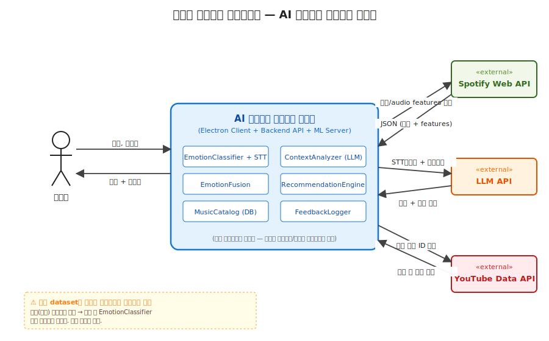
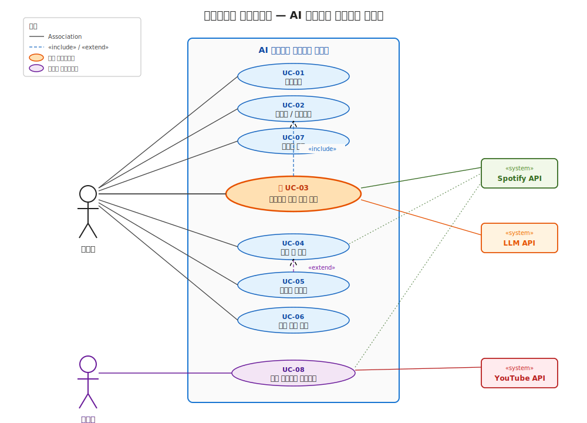

# AI 기반 감정 분석 음악 추천 시스템 — 설계 패키지 v1
**Software Requirements Specification (SRS) + 시스템 컨텍스트 + 유스케이스**

작성일: 2026-05-11

---

## 1. 시스템 개요

사용자의 **음성 입력**을 기반으로 **(a) 음성에서 추출한 감정**과 **(b) STT→LLM으로 분석한 맥락**을 융합하여, 사용자의 현재 상태에 부합하는 음악을 추천하는 데스크탑 애플리케이션. 추천 결과는 감정-음악 2D 매핑 차트와 LLM 기반 추천 이유 설명으로 함께 제공된다.

| 항목 | 결정 |
|---|---|
| 클라이언트 | Electron 크로스플랫폼 (Windows/macOS/Linux) |
| 입력 양식 | 음성 (마이크 녹음) |
| 분석 경로 | ML 감정분류 + STT→LLM 맥락분석 → 융합 |
| 음악 소스 | Spotify Web API (메인) + 캐글 dataset (학습용) + YouTube 감성 플리 (큐레이션 시드) |
| 시각화 | 감정-음악 2D 매핑 차트 + LLM 추천 이유 설명 |
| 평가 지표 | 좋아요율 · 재생완료율 · Precision@K |
| 배포 | Blue-Green 무중단 배포 (백엔드/ML 서버) |

---

## 2. 이해관계자 및 액터

### 2.1 이해관계자 (Stakeholders)
| 이해관계자 | 관심사 |
|---|---|
| 최종 사용자 | 자신의 감정과 맥락에 맞는 음악 추천 |
| 시스템 관리자 | 음악 카탈로그 품질 및 운영 안정성 |
| 개발팀 | 유지보수 가능한 코드, 무중단 배포 |
| 외부 서비스 제공자 (Spotify/LLM/YouTube) | API 사용량 정책 준수 |

### 2.2 액터 (Actors)
| 액터 | 유형 | 역할 |
|---|---|---|
| 사용자 | Primary | 음성 입력 → 추천 수신 → 피드백 |
| 관리자 | Primary | 음악 카탈로그 동기화 및 관리 |
| Spotify Web API | Secondary (External System) | audio features, 트랙 메타 제공 |
| LLM API | Secondary (External System) | 텍스트 맥락 분석, 추천 이유 생성 |
| YouTube Data API | Secondary (External System) | 감성 플리에서 시드 트랙 추출 |

---

## 3. 시스템 컨텍스트

> 시스템 경계 바깥에 위치하는 액터와 외부 시스템, 그리고 시스템과의 데이터 흐름을 정의한다.
> **주의:** 캐글 dataset은 ML 모델 **학습 시점에만** 사용되는 자원이며, 운영 중에는 학습 완료된 EmotionClassifier 모델로 흡수되어 있으므로 시스템 컨텍스트에 포함되지 않는다.

### 외부 인터페이스 요약
| 인터페이스 | 방향 | 데이터 | 빈도 |
|---|---|---|---|
| 사용자 → 시스템 | inbound | 음성 (WAV/WebM), 피드백 (좋아요/싫어요) | 요청당 |
| 시스템 → 사용자 | outbound | 추천 곡 리스트, 2D 차트, LLM 설명 텍스트 | 요청당 |
| 시스템 → Spotify Web API | outbound | 트랙 검색, audio features 조회 요청 | 추천당 1–10회 |
| Spotify Web API → 시스템 | inbound | JSON (트랙 메타 + audio features) | 위에 대응 |
| 시스템 → LLM API | outbound | STT 텍스트 + 분석 프롬프트 | 추천당 1–2회 |
| LLM API → 시스템 | inbound | 맥락 표현 + 추천 이유 텍스트 | 위에 대응 |
| 시스템 → YouTube Data API | outbound | 감성 플리 ID, 트랙 메타 요청 | 카탈로그 동기화 시 |
| YouTube Data API → 시스템 | inbound | 플리 내 트랙 메타 | 위에 대응 |

---

## 4. 기능 요구사항 (Functional Requirements)

우선순위: **M** (Must, 필수) · **S** (Should, 권장) · **C** (Could, 선택)

### FR1. 사용자 계정 관리
| ID | 요구사항 | 우선순위 |
|---|---|---|
| FR1.1 | 이메일/비밀번호로 회원가입 | M |
| FR1.2 | 로그인 / 로그아웃 | M |
| FR1.3 | 프로필 정보 수정 (선호 장르, 닉네임 등) | S |
| FR1.4 | 계정 탈퇴 (개인 데이터 영구 삭제) | M |

### FR2. 음성 기반 감정 입력
| ID | 요구사항 | 우선순위 |
|---|---|---|
| FR2.1 | 마이크 권한 요청 및 음성 녹음 (Electron MediaRecorder) | M |
| FR2.2 | 녹음된 음성을 백엔드로 안전하게 전송 (TLS) | M |
| FR2.3 | 녹음 중 시각적 피드백 (파형 또는 타이머) | S |
| FR2.4 | 최대 녹음 시간 제한 (기본 60초) | M |

### FR3. 감정 및 맥락 분석 (듀얼 트랙)
| ID | 요구사항 | 우선순위 |
|---|---|---|
| FR3.1 | 음성에서 감정 벡터 추출 — `EmotionClassifier` | M |
| FR3.2 | 음성 → 텍스트 변환 — `STTService` | M |
| FR3.3 | 텍스트에서 맥락 표현 추출 — `ContextAnalyzer` (LLM) | M |
| FR3.4 | 감정 벡터 + 맥락 표현 융합 — `EmotionFusion` | M |

### FR4. 음악 추천
| ID | 요구사항 | 우선순위 |
|---|---|---|
| FR4.1 | 융합 결과 → 카탈로그 유사도 매칭 — `RecommendationEngine` | M |
| FR4.2 | 상위 K개 추천 곡 반환 (기본 K=10) | M |
| FR4.3 | 각 추천 곡에 LLM 기반 추천 이유 첨부 | M |
| FR4.4 | 동일 입력에 대한 결과 캐싱 (TTL: 1시간) | S |

### FR5. 추천 결과 시각화
| ID | 요구사항 | 우선순위 |
|---|---|---|
| FR5.1 | 감정-음악 2D 매핑 차트 (valence × energy 평면) | M |
| FR5.2 | 추천 곡 리스트 (앨범 아트, 곡명, 아티스트) | M |
| FR5.3 | 추천 이유 텍스트 표시 | M |
| FR5.4 | 곡 재생 (YouTube embed 또는 Spotify 30초 preview) | M |

### FR6. 피드백 수집 및 개인화
| ID | 요구사항 | 우선순위 |
|---|---|---|
| FR6.1 | 곡별 좋아요/싫어요 입력 | M |
| FR6.2 | 재생 시작/종료/완료 이벤트 로깅 | M |
| FR6.3 | 피드백을 사용자 프로필에 누적 | M |
| FR6.4 | 누적 피드백을 추천 시 가중치로 반영 | M |
| FR6.5 | 추천 이력 조회 (최근 N개) | S |

### FR7. 음악 카탈로그 관리 (관리자)
| ID | 요구사항 | 우선순위 |
|---|---|---|
| FR7.1 | YouTube 감성 플리에서 시드 트랙 추출 | M |
| FR7.2 | 추출된 트랙을 Spotify에서 매칭 → 카탈로그 적재 | M |
| FR7.3 | 주기적 카탈로그 새로고침 (스케줄러 또는 수동 트리거) | S |
| FR7.4 | 라이선스/지역 가용성 필터링 | S |

---

## 5. 비기능 요구사항 (Non-Functional Requirements)

### NFR1. 성능 (Performance)
| ID | 요구사항 | 측정 방법 |
|---|---|---|
| NFR1.1 | 음성 전송 → 추천 응답 시간 ≤ **3초** (P95) | 부하 테스트 |
| NFR1.2 | 동시 사용자 **100명** 처리 가능 | 부하 테스트 |
| NFR1.3 | ML 추론 ≤ **1.5초** | 컴포넌트 벤치마크 |

### NFR2. 가용성 (Availability)
| ID | 요구사항 |
|---|---|
| NFR2.1 | 백엔드 API 가용성 ≥ **99%** (월간) |
| NFR2.2 | **Blue-Green 배포**로 무중단 업데이트 (다운타임 0초) |
| NFR2.3 | LLM API 장애 시 fallback: 룰베이스 맥락 추출로 추천 지속 |
| NFR2.4 | ML 모델 장애 시 fallback: 텍스트 기반 추천만으로 응답 |

### NFR3. 보안 및 프라이버시 (Security & Privacy)
| ID | 요구사항 |
|---|---|
| NFR3.1 | 모든 통신은 **TLS 1.2+** 사용 |
| NFR3.2 | 음성 원본은 분석 후 **즉시 폐기** (감정 벡터만 저장) |
| NFR3.3 | STT 변환 텍스트는 사용자 동의 시에만 저장 |
| NFR3.4 | 비밀번호 **bcrypt** 해싱 (cost ≥ 12) |
| NFR3.5 | API 키는 환경변수로 관리, 클라이언트에 노출 금지 |

### NFR4. 신뢰성 / 품질 (Reliability & Quality)
| ID | 요구사항 |
|---|---|
| NFR4.1 | 추천 품질: 좋아요율 ≥ **50%** (베타 기준) |
| NFR4.2 | Precision@10 ≥ **0.4** |
| NFR4.3 | ML 모델 정확도 (캐글 테스트셋) ≥ **70%** |
| NFR4.4 | 단위/통합 테스트 커버리지 ≥ **70%** |

### NFR5. 사용성 (Usability)
| ID | 요구사항 |
|---|---|
| NFR5.1 | 첫 추천까지 음성 입력 ≤ **3 클릭** |
| NFR5.2 | 차트는 색맹 대응 색상 팔레트 사용 |

### NFR6. 이식성 (Portability)
| ID | 요구사항 |
|---|---|
| NFR6.1 | Windows 10+, macOS 12+, Ubuntu 22+ 지원 |

---

## 6. 유스케이스

### 6.1 유스케이스 목록
| ID | 이름 | Primary Actor |
|---|---|---|
| UC-01 | 회원가입 | 사용자 |
| UC-02 | 로그인 / 로그아웃 | 사용자 |
| UC-03 | **음성으로 음악 추천 받기** ⭐ 핵심 | 사용자 |
| UC-04 | 추천 곡 재생 | 사용자 |
| UC-05 | 피드백 남기기 (좋아요/싫어요) | 사용자 |
| UC-06 | 추천 이력 조회 | 사용자 |
| UC-07 | 프로필 수정 | 사용자 |
| UC-08 | 음악 카탈로그 새로고침 | 관리자 |

### 6.2 핵심 유스케이스 상세 명세

#### UC-03: 음성으로 음악 추천 받기

| 항목 | 내용 |
|---|---|
| **ID** | UC-03 |
| **이름** | 음성으로 음악 추천 받기 |
| **설명** | 사용자가 자신의 현재 상태를 음성으로 표현하면, 시스템이 음성의 감정과 맥락을 분석해 음악을 추천한다 |
| **Primary Actor** | 사용자 |
| **Secondary Actors** | Spotify Web API, LLM API |
| **사전 조건** | 1. 사용자가 로그인되어 있음 2. 마이크 권한이 허용되어 있음 3. 음악 카탈로그가 1회 이상 동기화되어 있음 |
| **사후 조건** | 1. 추천 결과가 화면에 표시됨 2. 추천 요청 이력이 사용자 프로필에 기록됨 |
| **트리거** | 사용자가 메인 화면의 "녹음 시작" 버튼 클릭 |

**주 시나리오 (Main Flow):**
1. 사용자가 "녹음 시작"을 누른다.
2. 시스템이 마이크를 활성화하고 시각적 피드백(파형)을 표시한다.
3. 사용자가 자신의 상태를 말한다.
4. 사용자가 "녹음 종료"를 누르거나 60초가 경과한다.
5. 시스템이 음성을 백엔드로 전송한다 (TLS).
6. 백엔드는 다음을 **병렬로** 수행한다:
   - **(a)** `EmotionClassifier`로 감정 벡터 추출
   - **(b)** `STTService`로 텍스트 변환 → `ContextAnalyzer` (LLM)로 맥락 표현 추출
7. `EmotionFusion`이 (a)와 (b)를 융합한다.
8. `RecommendationEngine`이 융합 결과로 카탈로그에서 유사도 매칭하여 상위 10곡을 선정한다.
9. LLM이 각 추천 곡에 대한 짧은 추천 이유를 생성한다.
10. 시스템이 추천 결과를 클라이언트로 응답한다 (≤ 3초, NFR1.1).
11. 클라이언트가 2D 감정-음악 매핑 차트와 곡 리스트, 추천 이유를 렌더링한다.

**대체 시나리오 (Alternative Flows):**
- **A1 (LLM API 장애):** 6(b)에서 LLM 응답 실패 → 룰베이스 키워드 추출로 fallback (NFR2.3). 추천 이유는 "유사 감성 곡" 같은 기본 텍스트로 대체.
- **A2 (ML 모델 장애):** 6(a)에서 EmotionClassifier 실패 → 맥락 표현만으로 추천 진행 (NFR2.4).
- **A3 (Spotify API 호출 실패):** 캐시된 카탈로그에서만 매칭. 캐시도 비어있으면 오류 메시지 표시.

**예외 시나리오 (Exception Flows):**
- **E1 (마이크 권한 거부):** 1단계에서 권한 거부 → 권한 안내 다이얼로그 표시, 유스케이스 종료.
- **E2 (음성이 너무 짧음, <2초):** 5단계에서 검증 실패 → "조금 더 길게 말씀해 주세요" 안내, 1단계로 복귀.
- **E3 (네트워크 단절):** 5단계에서 전송 실패 → 재시도 옵션 제공.

---

## 7. 도메인 어휘 (컴포넌트 사전)

후속 다이어그램(클래스, 시퀀스, 아키텍처)에서 일관되게 사용할 명칭.

| 컴포넌트 | 책임 | 위치 |
|---|---|---|
| `VoiceCapture` | Electron MediaRecorder로 음성 녹음 및 전송 | Client |
| `EmotionClassifier` | 캐글 학습 모델, 음성 → 감정 벡터 | ML Server |
| `STTService` | 음성 → 텍스트 변환 | Backend |
| `ContextAnalyzer` | LLM, 텍스트 → 맥락 표현 | Backend (LLM API 호출) |
| `EmotionFusion` | 감정 벡터 + 맥락 → 통합 쿼리 | Backend |
| `RecommendationEngine` | Spotify audio features 기반 유사도 매칭 | Backend |
| `MusicCatalog` | Spotify + YouTube 시드로 구축된 곡 풀 | Backend (DB) |
| `FeedbackLogger` | 좋아요/싫어요/재생률 기록 | Backend |
| `RecommendationVisualizer` | 2D 차트 + LLM 이유 설명 렌더링 | Client |
| `CatalogSynchronizer` | YouTube 플리 → Spotify 매칭 → 카탈로그 적재 | Backend (Scheduler) |

---

## 8. 가정 및 제약사항 (Assumptions & Constraints)

### 가정 (Assumptions)
- 사용자는 본인 음성을 정상적으로 녹음할 수 있는 환경에 있다 (마이크 보유).
- Spotify Web API의 audio features는 추천 매칭에 사용 가능한 수준의 메타데이터를 제공한다.
- LLM API의 응답 시간은 평균 2초 이내이다.

### 제약사항 (Constraints)
- Spotify Premium 계정이 없는 사용자를 위해 실제 재생은 YouTube embed 또는 30초 preview로 제한된다.
- 캐글 dataset의 라이선스 범위 내에서만 학습 모델을 사용한다.
- 학기말 프로젝트 기간 (약 4–6주) 내에 핵심 유스케이스 (UC-03)를 시연 가능한 수준까지 구현해야 한다.

---

## 9. 변경 이력

| 버전 | 일자 | 작성자 | 변경 사항 |
|---|---|---|---|
| v1 | 2026-05-11 | 박우현 | 초안 작성 |
